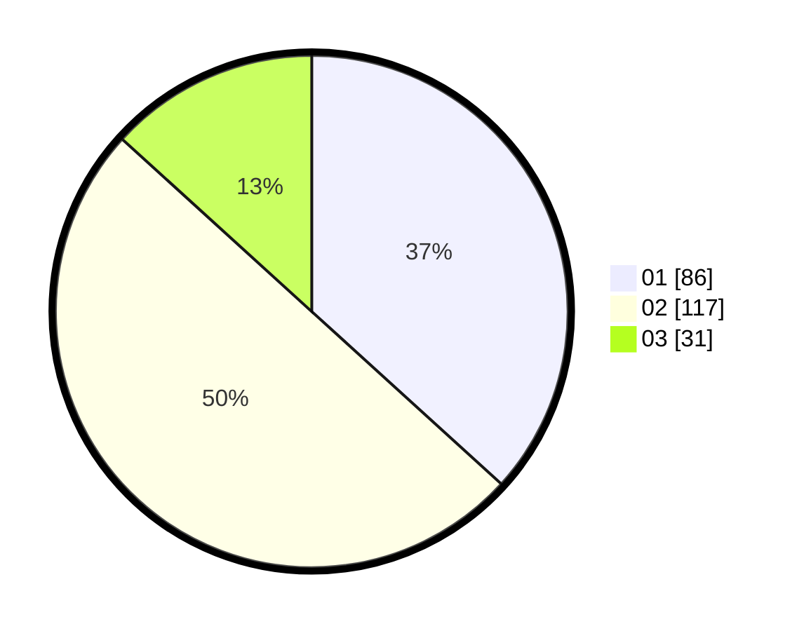

# Hasil

Hasil perolehan suara paslon dapat dilihat pada file paslon-01.txt, paslon-02.txt, dan paslon-03.txt.

Jika tidak ada, artinya data tersebut belum ada pada SIREKAP.

## Perolehan Suara

 * Paslon 01: **86**.
 * Paslon 02: **117**.
 * Paslon 03: **31**.

## Foto C Plano

https://sirekap-obj-formc.kpu.go.id/4c6b/pemilu/ppwp/31/73/06/10/02/3173061002011-20240214-155503--08316255-aae4-4ce5-9b7a-ad895db3c998.jpg

https://sirekap-obj-formc.kpu.go.id/4c6b/pemilu/ppwp/31/73/06/10/02/3173061002011-20240214-155721--302cb313-e256-4334-832c-fdc070ccb92d.jpg

https://sirekap-obj-formc.kpu.go.id/4c6b/pemilu/ppwp/31/73/06/10/02/3173061002011-20240214-162211--e557d4f6-4cf4-432d-922f-2e9392543e36.jpg

## DATA PEMILIH TETAP

Jumlah pemilih dalam DPT: **208**.
 * L: **101**.
 * P: **469**.

## DATA PENGGUNA HAK PILIH

Jumlah pengguna hak pilih dalam DPT: **288**.
 * L: **153**.
 * P: **135**.

Jumlah pengguna hak pilih dalam DPTb: **13**.
 * L: **6**.
 * P: **9**.

Jumlah pengguna hak pilih dalam DPK: **5**.
 * L: **2**.
 * P: **3**.

Jumlah pengguna hak pilih: **308**.
 * L: **161**.
 * P: **147**.

## JUMLAH SUARA SAH DAN TIDAK SAH

JUMLAH SELURUH SUARA SAH: **234**.

JUMLAH SUARA TIDAK SAH: **4**.

JUMLAH SELURUH SUARA SAH DAN SUARA TIDAK SAH: **238**.
