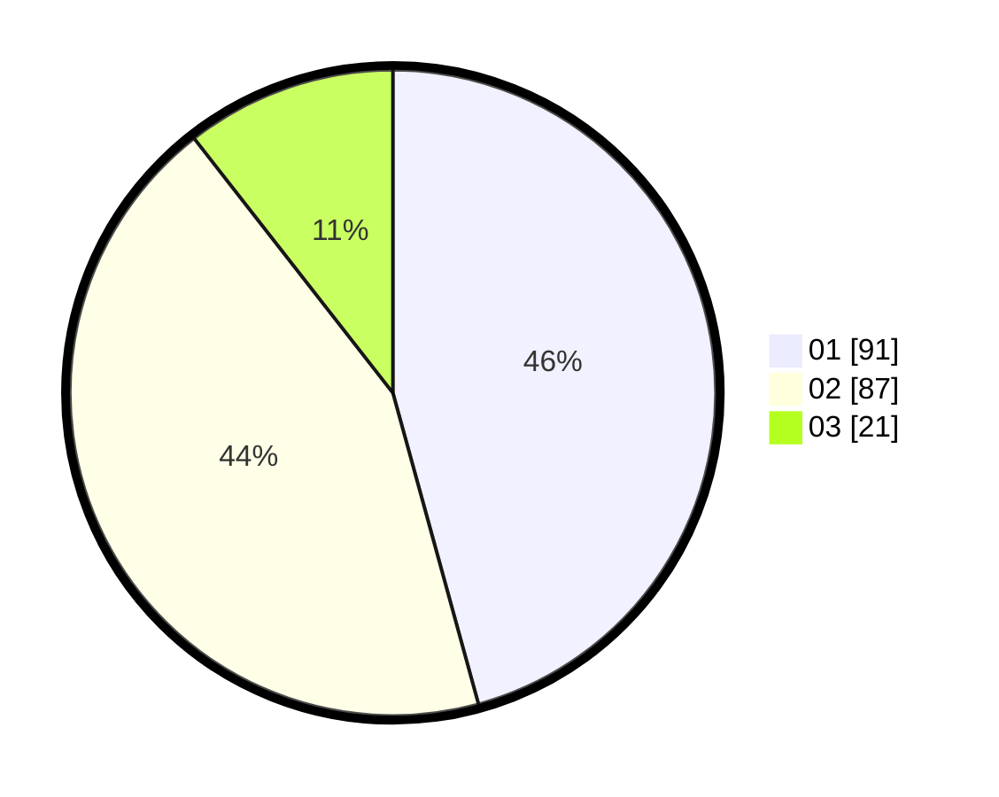

# Hasil

Hasil perolehan suara paslon dapat dilihat pada file paslon-01.txt, paslon-02.txt, dan paslon-03.txt.

Jika tidak ada, artinya data tersebut belum ada pada SIREKAP.

## Perolehan Suara

 * Paslon 01: **91**.
 * Paslon 02: **87**.
 * Paslon 03: **21**.

## Foto C Plano

https://sirekap-obj-formc.kpu.go.id/c412/pemilu/ppwp/31/73/06/10/02/3173061002019-20240215-014859--2cc4085f-e597-44e4-b7a7-6802dfbda474.jpg

https://sirekap-obj-formc.kpu.go.id/c412/pemilu/ppwp/31/73/06/10/02/3173061002019-20240215-015131--02d23164-3678-493e-a16d-d13a3ff1c919.jpg

https://sirekap-obj-formc.kpu.go.id/c412/pemilu/ppwp/31/73/06/10/02/3173061002019-20240215-015604--47d17974-c992-4c33-97e6-b675d62f82f7.jpg

## DATA PEMILIH TETAP

Jumlah pemilih dalam DPT: **291**.
 * L: **140**.
 * P: **151**.

## DATA PENGGUNA HAK PILIH

Jumlah pengguna hak pilih dalam DPT: **201**.
 * L: **97**.
 * P: **104**.

Jumlah pengguna hak pilih dalam DPTb: **0**.
 * L: **0**.
 * P: **0**.

Jumlah pengguna hak pilih dalam DPK: **2**.
 * L: **0**.
 * P: **2**.

Jumlah pengguna hak pilih: **203**.
 * L: **0**.
 * P: **0**.

## JUMLAH SUARA SAH DAN TIDAK SAH

JUMLAH SELURUH SUARA SAH: **199**.

JUMLAH SUARA TIDAK SAH: **6**.

JUMLAH SELURUH SUARA SAH DAN SUARA TIDAK SAH: **205**.
