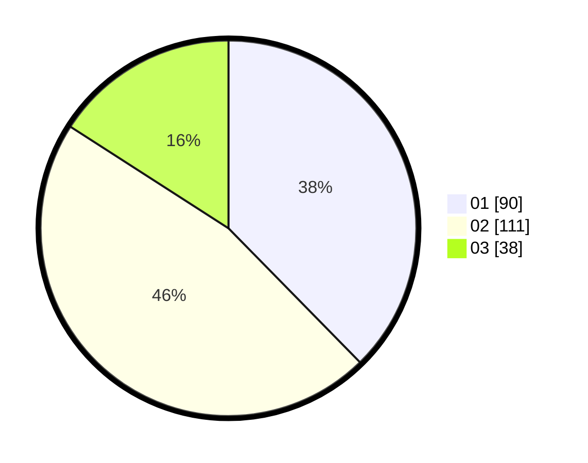

# Hasil

Hasil perolehan suara paslon dapat dilihat pada file paslon-01.txt, paslon-02.txt, dan paslon-03.txt.

Jika tidak ada, artinya data tersebut belum ada pada SIREKAP.

## Perolehan Suara

 * Paslon 01: **90**.
 * Paslon 02: **111**.
 * Paslon 03: **38**.

## Foto C Plano

https://sirekap-obj-formc.kpu.go.id/0d39/pemilu/ppwp/31/73/06/10/02/3173061002020-20240214-185619--f88cfe4e-3b43-4a1e-a9a9-4a25e1a77c2f.jpg

https://sirekap-obj-formc.kpu.go.id/0d39/pemilu/ppwp/31/73/06/10/02/3173061002020-20240214-185644--4f23417d-6554-43eb-a0fe-c696bfc02a41.jpg

https://sirekap-obj-formc.kpu.go.id/0d39/pemilu/ppwp/31/73/06/10/02/3173061002020-20240214-185733--468180c2-7c7c-4a93-a1c8-777927a4c511.jpg

## DATA PEMILIH TETAP

Jumlah pemilih dalam DPT: **294**.
 * L: **151**.
 * P: **143**.

## DATA PENGGUNA HAK PILIH

Jumlah pengguna hak pilih dalam DPT: **242**.
 * L: **122**.
 * P: **120**.

Jumlah pengguna hak pilih dalam DPTb: **1**.
 * L: **1**.
 * P: **0**.

Jumlah pengguna hak pilih dalam DPK: **0**.
 * L: **0**.
 * P: **0**.

Jumlah pengguna hak pilih: **243**.
 * L: **242**.
 * P: **1**.

## JUMLAH SUARA SAH DAN TIDAK SAH

JUMLAH SELURUH SUARA SAH: **243**.

JUMLAH SUARA TIDAK SAH: **4**.

JUMLAH SELURUH SUARA SAH DAN SUARA TIDAK SAH: **243**.
