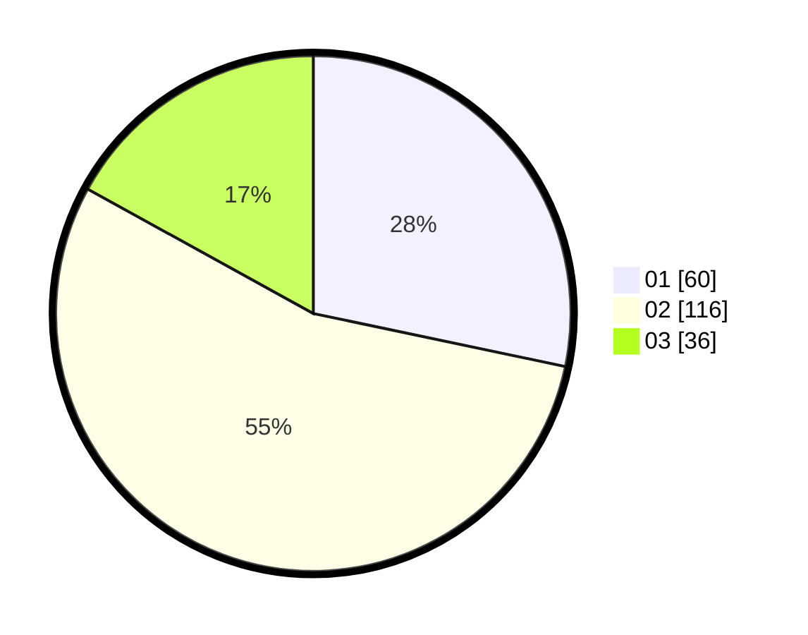

# Hasil

Hasil perolehan suara paslon dapat dilihat pada file paslon-01.txt, paslon-02.txt, dan paslon-03.txt.

Jika tidak ada, artinya data tersebut belum ada pada SIREKAP.

## Perolehan Suara

 * Paslon 01: **60**.
 * Paslon 02: **116**.
 * Paslon 03: **36**.

## Foto C Plano

https://sirekap-obj-formc.kpu.go.id/d404/pemilu/ppwp/31/73/06/10/02/3173061002022-20240215-002309--fe6de54a-adf7-473f-9873-6f229e9e3310.jpg

https://sirekap-obj-formc.kpu.go.id/d404/pemilu/ppwp/31/73/06/10/02/3173061002022-20240215-000848--b0a1c19c-b495-4fcd-b34c-3c0fe725d439.jpg

https://sirekap-obj-formc.kpu.go.id/d404/pemilu/ppwp/31/73/06/10/02/3173061002022-20240215-002139--4acea37b-67c9-4d6d-8d1d-69e586e04960.jpg
