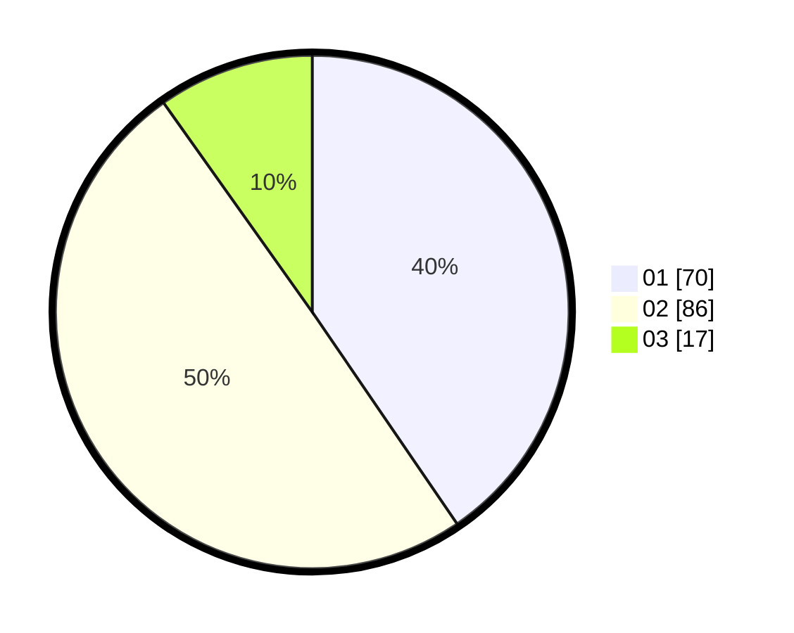

# Hasil

Hasil perolehan suara paslon dapat dilihat pada file paslon-01.txt, paslon-02.txt, dan paslon-03.txt.

Jika tidak ada, artinya data tersebut belum ada pada SIREKAP.

## Perolehan Suara

 * Paslon 01: **70**.
 * Paslon 02: **86**.
 * Paslon 03: **17**.

## Foto C Plano

https://sirekap-obj-formc.kpu.go.id/676a/pemilu/ppwp/31/73/06/10/02/3173061002024-20240215-002149--6aa9392e-7304-4bf5-9b84-2a178cfb2ed0.jpg

https://sirekap-obj-formc.kpu.go.id/676a/pemilu/ppwp/31/73/06/10/02/3173061002024-20240215-002333--80e33df5-0ea5-4884-9cf3-91446cebc37d.jpg

https://sirekap-obj-formc.kpu.go.id/676a/pemilu/ppwp/31/73/06/10/02/3173061002024-20240215-002227--769eeda4-ab6b-4dab-944f-3d230a399614.jpg

## DATA PEMILIH TETAP

Jumlah pemilih dalam DPT: **262**.
 * L: **128**.
 * P: **134**.

## DATA PENGGUNA HAK PILIH

Jumlah pengguna hak pilih dalam DPT: **164**.
 * L: **73**.
 * P: **91**.

Jumlah pengguna hak pilih dalam DPTb: **8**.
 * L: **4**.
 * P: **4**.

Jumlah pengguna hak pilih dalam DPK: **4**.
 * L: **3**.
 * P: **1**.

Jumlah pengguna hak pilih: **176**.
 * L: **80**.
 * P: **96**.

## JUMLAH SUARA SAH DAN TIDAK SAH

JUMLAH SELURUH SUARA SAH: **173**.

JUMLAH SUARA TIDAK SAH: **3**.

JUMLAH SELURUH SUARA SAH DAN SUARA TIDAK SAH: **176**.
