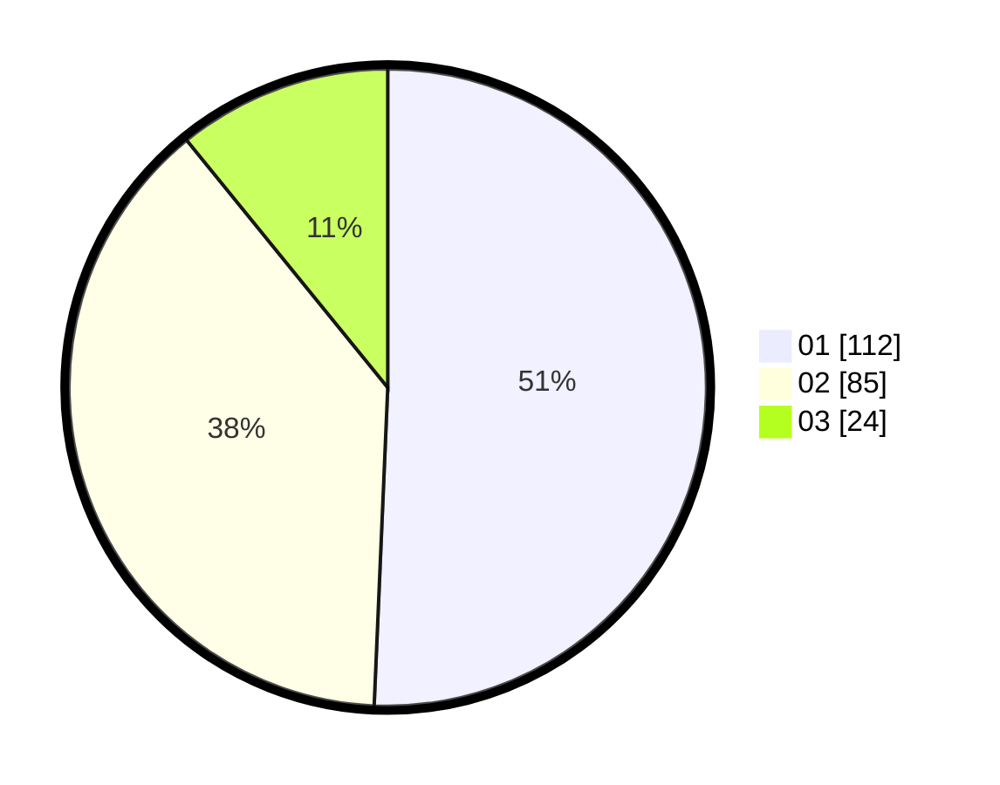

# Hasil

Hasil perolehan suara paslon dapat dilihat pada file paslon-01.txt, paslon-02.txt, dan paslon-03.txt.

Jika tidak ada, artinya data tersebut belum ada pada SIREKAP.

## Perolehan Suara

 * Paslon 01: **112**.
 * Paslon 02: **85**.
 * Paslon 03: **24**.

## Foto C Plano

https://sirekap-obj-formc.kpu.go.id/d6fd/pemilu/ppwp/31/73/06/10/02/3173061002028-20240214-202235--65fcda6f-fbdc-4e00-9f10-7bf1de73f16a.jpg

https://sirekap-obj-formc.kpu.go.id/d6fd/pemilu/ppwp/31/73/06/10/02/3173061002028-20240214-201855--6f517958-1064-4e1f-9ef7-ac42116abc7c.jpg

https://sirekap-obj-formc.kpu.go.id/d6fd/pemilu/ppwp/31/73/06/10/02/3173061002028-20240215-002819--8f7c7cc7-c658-454a-9a9d-c7fdfb2a738a.jpg

## DATA PEMILIH TETAP

Jumlah pemilih dalam DPT: **279**.
 * L: **150**.
 * P: **129**.

## DATA PENGGUNA HAK PILIH

Jumlah pengguna hak pilih dalam DPT: **217**.
 * L: **113**.
 * P: **104**.

Jumlah pengguna hak pilih dalam DPTb: **0**.
 * L: **0**.
 * P: **0**.

Jumlah pengguna hak pilih dalam DPK: **5**.
 * L: **2**.
 * P: **3**.

Jumlah pengguna hak pilih: **222**.
 * L: **115**.
 * P: **107**.

## JUMLAH SUARA SAH DAN TIDAK SAH

JUMLAH SELURUH SUARA SAH: **221**.

JUMLAH SUARA TIDAK SAH: **1**.

JUMLAH SELURUH SUARA SAH DAN SUARA TIDAK SAH: **222**.
