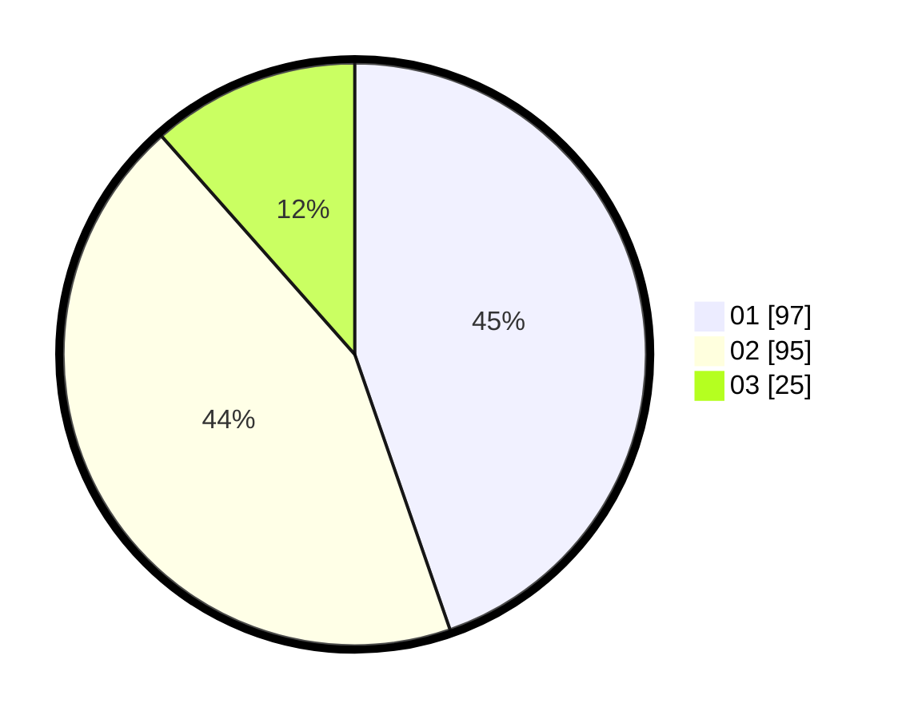

# Hasil

Hasil perolehan suara paslon dapat dilihat pada file paslon-01.txt, paslon-02.txt, dan paslon-03.txt.

Jika tidak ada, artinya data tersebut belum ada pada SIREKAP.

## Perolehan Suara

 * Paslon 01: **97**.
 * Paslon 02: **95**.
 * Paslon 03: **25**.

## Foto C Plano

https://sirekap-obj-formc.kpu.go.id/96ee/pemilu/ppwp/31/73/06/10/02/3173061002029-20240214-220926--6d8d3adc-d59c-4c17-bbf0-6d6f1ccdf626.jpg

https://sirekap-obj-formc.kpu.go.id/96ee/pemilu/ppwp/31/73/06/10/02/3173061002029-20240215-001950--5ae5eae3-4801-401b-88cd-6d6036401870.jpg

https://sirekap-obj-formc.kpu.go.id/96ee/pemilu/ppwp/31/73/06/10/02/3173061002029-20240214-220502--d2cd710f-1fcc-4211-b784-ec1ac32b91ed.jpg
