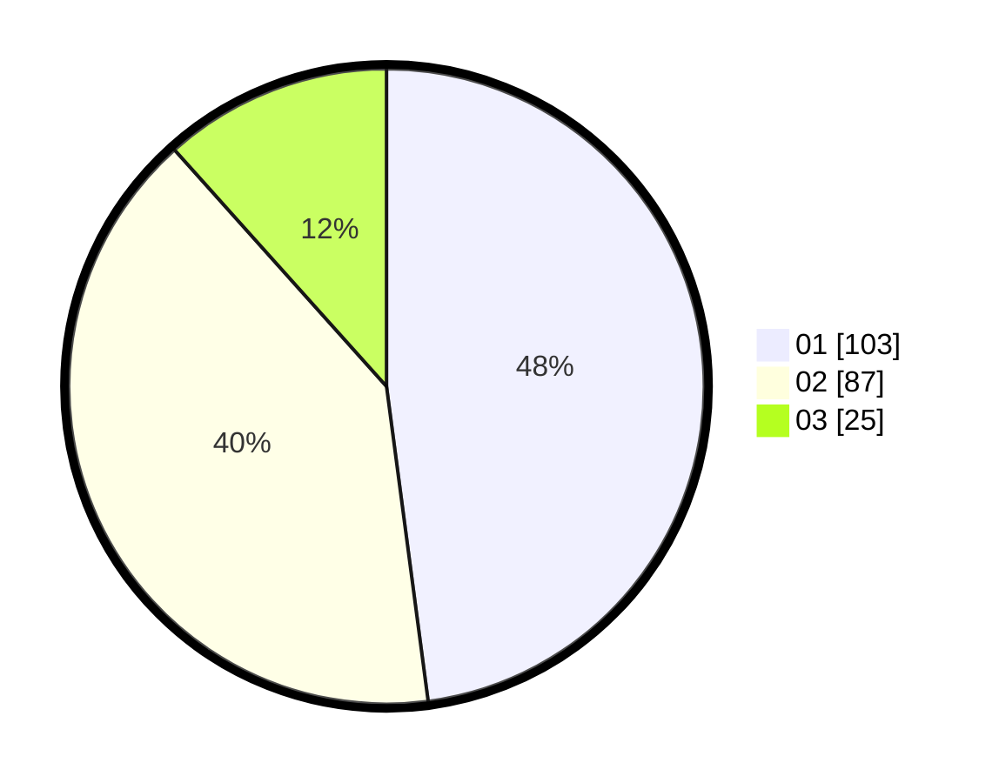

# Hasil

Hasil perolehan suara paslon dapat dilihat pada file paslon-01.txt, paslon-02.txt, dan paslon-03.txt.

Jika tidak ada, artinya data tersebut belum ada pada SIREKAP.

## Perolehan Suara

 * Paslon 01: **103**.
 * Paslon 02: **87**.
 * Paslon 03: **25**.

## Foto C Plano

https://sirekap-obj-formc.kpu.go.id/899e/pemilu/ppwp/31/73/06/10/02/3173061002030-20240215-024057--0539245b-cf4d-4349-bec0-64681183ba73.jpg

https://sirekap-obj-formc.kpu.go.id/899e/pemilu/ppwp/31/73/06/10/02/3173061002030-20240215-024334--c9eed0db-3f9a-4204-a3cb-35951b01d1ef.jpg

https://sirekap-obj-formc.kpu.go.id/899e/pemilu/ppwp/31/73/06/10/02/3173061002030-20240215-024650--f0a44fb8-a00c-4c9d-84fe-c770137904fd.jpg
