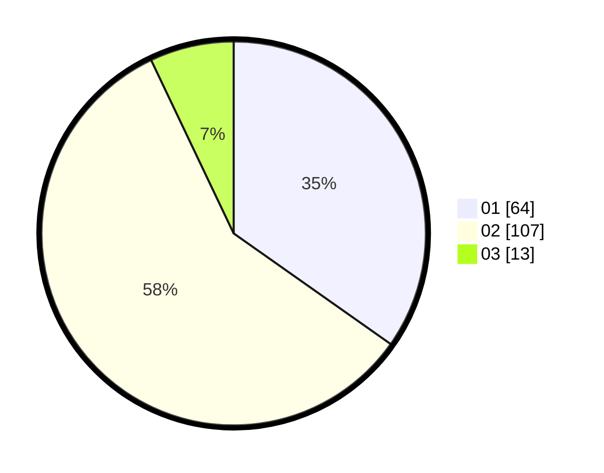

# Hasil

Hasil perolehan suara paslon dapat dilihat pada file paslon-01.txt, paslon-02.txt, dan paslon-03.txt.

Jika tidak ada, artinya data tersebut belum ada pada SIREKAP.

## Perolehan Suara

 * Paslon 01: **64**.
 * Paslon 02: **107**.
 * Paslon 03: **13**.

## Foto C Plano

https://sirekap-obj-formc.kpu.go.id/e6bb/pemilu/ppwp/31/73/06/10/02/3173061002033-20240216-024446--bbe7f90f-b7a6-4d83-a345-ee273b3206c3.jpg

https://sirekap-obj-formc.kpu.go.id/e6bb/pemilu/ppwp/31/73/06/10/02/3173061002033-20240216-024449--42e2c113-6059-4047-a4cb-2f396ca3d227.jpg

https://sirekap-obj-formc.kpu.go.id/e6bb/pemilu/ppwp/31/73/06/10/02/3173061002033-20240216-024447--dc9a2eb0-88b3-47c7-9e2c-baeda2ef307f.jpg

## DATA PEMILIH TETAP

Jumlah pemilih dalam DPT: **243**.
 * L: **119**.
 * P: **124**.

## DATA PENGGUNA HAK PILIH

Jumlah pengguna hak pilih dalam DPT: **183**.
 * L: **85**.
 * P: **98**.

Jumlah pengguna hak pilih dalam DPTb: **0**.
 * L: **0**.
 * P: **0**.

Jumlah pengguna hak pilih dalam DPK: **4**.
 * L: **1**.
 * P: **3**.

Jumlah pengguna hak pilih: **187**.
 * L: **86**.
 * P: **101**.

## JUMLAH SUARA SAH DAN TIDAK SAH

JUMLAH SELURUH SUARA SAH: **184**.

JUMLAH SUARA TIDAK SAH: **3**.

JUMLAH SELURUH SUARA SAH DAN SUARA TIDAK SAH: **187**.
