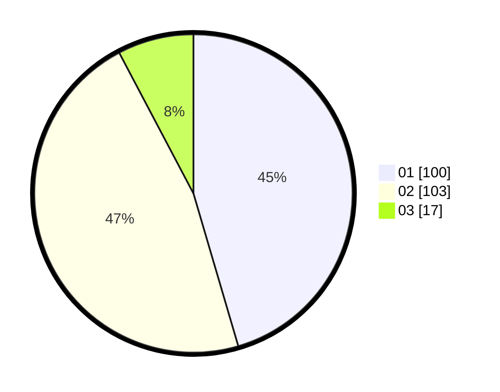

# Hasil

Hasil perolehan suara paslon dapat dilihat pada file paslon-01.txt, paslon-02.txt, dan paslon-03.txt.

Jika tidak ada, artinya data tersebut belum ada pada SIREKAP.

## Perolehan Suara

 * Paslon 01: **100**.
 * Paslon 02: **103**.
 * Paslon 03: **17**.

## Foto C Plano

https://sirekap-obj-formc.kpu.go.id/dec6/pemilu/ppwp/31/73/06/10/02/3173061002037-20240214-225101--da61467d-47f8-47fe-a44e-588968547f7a.jpg

https://sirekap-obj-formc.kpu.go.id/dec6/pemilu/ppwp/31/73/06/10/02/3173061002037-20240214-225211--cf51f3d7-e83e-48a0-a636-63990e7cb6ee.jpg

https://sirekap-obj-formc.kpu.go.id/dec6/pemilu/ppwp/31/73/06/10/02/3173061002037-20240214-225304--ed0326bc-4e67-4814-b57d-520a28e79846.jpg
