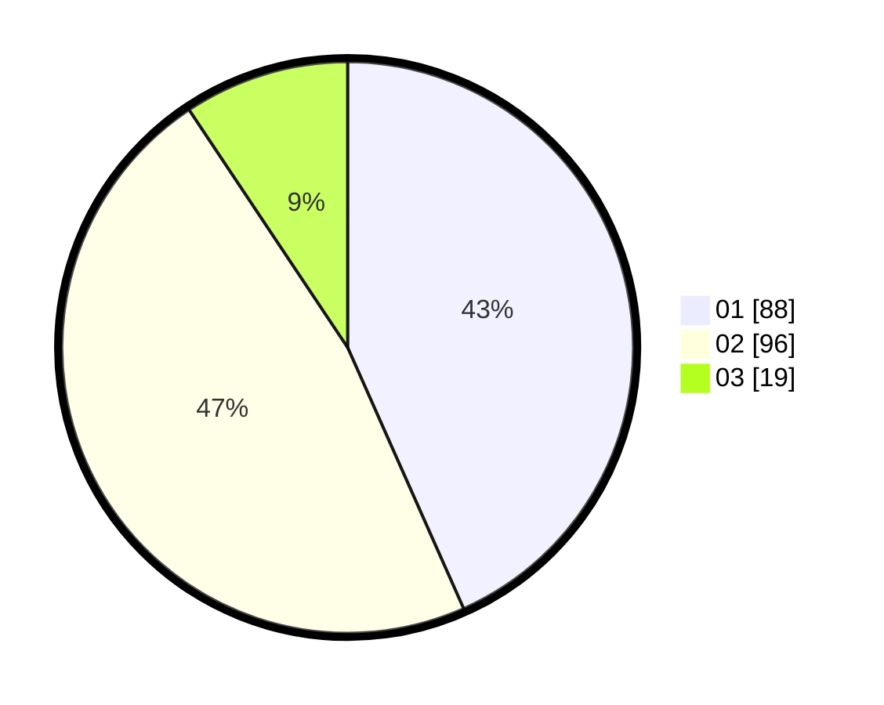

# Hasil

Hasil perolehan suara paslon dapat dilihat pada file paslon-01.txt, paslon-02.txt, dan paslon-03.txt.

Jika tidak ada, artinya data tersebut belum ada pada SIREKAP.

## Perolehan Suara

 * Paslon 01: **88**.
 * Paslon 02: **96**.
 * Paslon 03: **19**.

## Foto C Plano

https://sirekap-obj-formc.kpu.go.id/6410/pemilu/ppwp/31/73/06/10/02/3173061002038-20240214-213556--63a35f11-8c64-40a9-a737-5ff3f8a221a3.jpg

https://sirekap-obj-formc.kpu.go.id/6410/pemilu/ppwp/31/73/06/10/02/3173061002038-20240214-213628--6600300e-2d3b-4dad-88d4-5aaefcabe940.jpg

https://sirekap-obj-formc.kpu.go.id/6410/pemilu/ppwp/31/73/06/10/02/3173061002038-20240214-213654--b18f7166-6bd9-4491-8ff6-d4482ce5ee64.jpg
