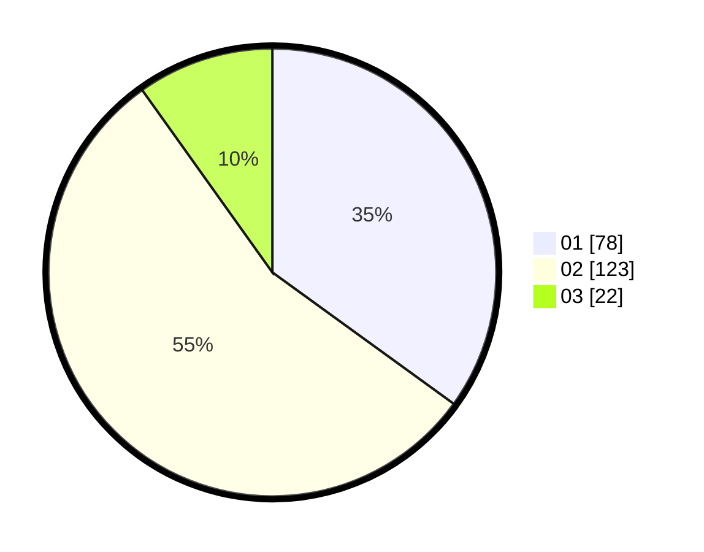

# Hasil

Hasil perolehan suara paslon dapat dilihat pada file paslon-01.txt, paslon-02.txt, dan paslon-03.txt.

Jika tidak ada, artinya data tersebut belum ada pada SIREKAP.

## Perolehan Suara

 * Paslon 01: **78**.
 * Paslon 02: **123**.
 * Paslon 03: **22**.

## Foto C Plano

https://sirekap-obj-formc.kpu.go.id/1b1c/pemilu/ppwp/31/73/06/10/02/3173061002040-20240214-195015--42586ca1-790d-43c0-a374-b96179c5ba68.jpg

https://sirekap-obj-formc.kpu.go.id/1b1c/pemilu/ppwp/31/73/06/10/02/3173061002040-20240214-195408--f856b7e6-f0a2-45fa-8b80-573a64c0ab56.jpg

https://sirekap-obj-formc.kpu.go.id/1b1c/pemilu/ppwp/31/73/06/10/02/3173061002040-20240214-195631--e6e40810-7208-45f8-abba-d6b4aa801088.jpg

## DATA PEMILIH TETAP

Jumlah pemilih dalam DPT: **282**.
 * L: **147**.
 * P: **135**.

## DATA PENGGUNA HAK PILIH

Jumlah pengguna hak pilih dalam DPT: **224**.
 * L: **117**.
 * P: **107**.

Jumlah pengguna hak pilih dalam DPTb: **1**.
 * L: **0**.
 * P: **1**.

Jumlah pengguna hak pilih dalam DPK: **1**.
 * L: **0**.
 * P: **1**.

Jumlah pengguna hak pilih: **226**.
 * L: **117**.
 * P: **109**.

## JUMLAH SUARA SAH DAN TIDAK SAH

JUMLAH SELURUH SUARA SAH: **223**.

JUMLAH SUARA TIDAK SAH: **3**.

JUMLAH SELURUH SUARA SAH DAN SUARA TIDAK SAH: **226**.
