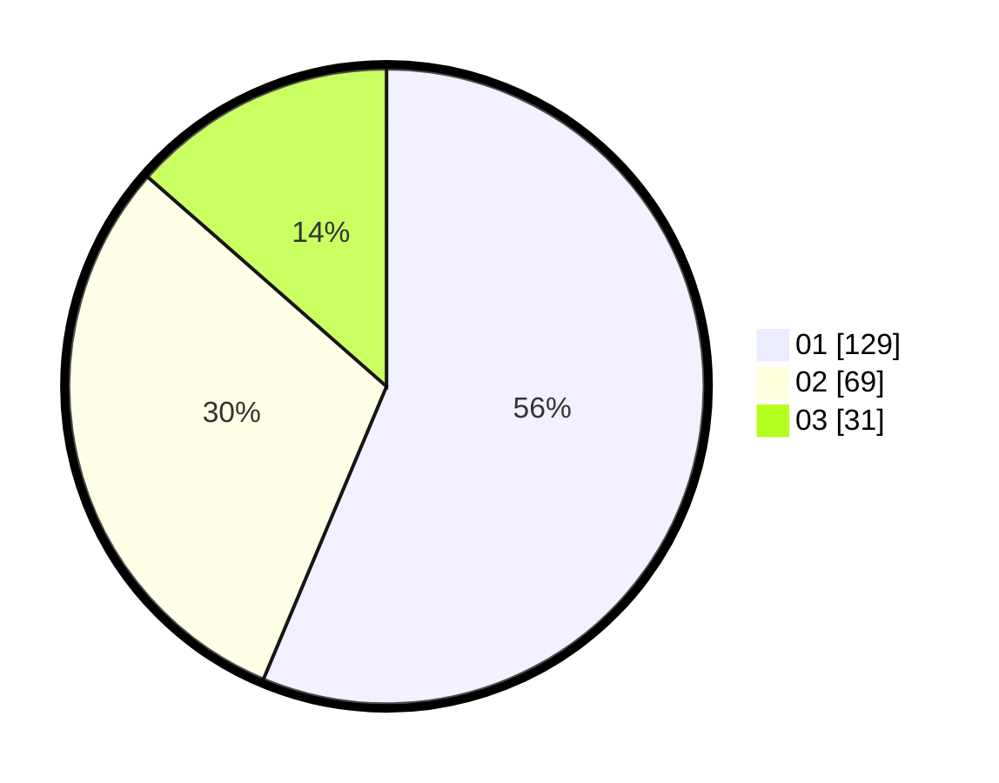

# Hasil

Hasil perolehan suara paslon dapat dilihat pada file paslon-01.txt, paslon-02.txt, dan paslon-03.txt.

Jika tidak ada, artinya data tersebut belum ada pada SIREKAP.

## Perolehan Suara

 * Paslon 01: **129**.
 * Paslon 02: **69**.
 * Paslon 03: **31**.

## Foto C Plano

https://sirekap-obj-formc.kpu.go.id/fcc9/pemilu/ppwp/31/73/06/10/02/3173061002046-20240215-015621--007e673d-8f14-49a0-bfd2-335bd2713827.jpg

https://sirekap-obj-formc.kpu.go.id/fcc9/pemilu/ppwp/31/73/06/10/02/3173061002046-20240215-015725--7115a31b-2e82-4166-a4c5-4dbb844572c5.jpg

https://sirekap-obj-formc.kpu.go.id/fcc9/pemilu/ppwp/31/73/06/10/02/3173061002046-20240215-015834--b4ba1d39-748b-4df0-a9a1-b05a4a210bbf.jpg

## DATA PEMILIH TETAP

Jumlah pemilih dalam DPT: **275**.
 * L: **142**.
 * P: **133**.

## DATA PENGGUNA HAK PILIH

Jumlah pengguna hak pilih dalam DPT: **227**.
 * L: **114**.
 * P: **113**.

Jumlah pengguna hak pilih dalam DPTb: **1**.
 * L: **0**.
 * P: **1**.

Jumlah pengguna hak pilih dalam DPK: **7**.
 * L: **1**.
 * P: **6**.

Jumlah pengguna hak pilih: **235**.
 * L: **115**.
 * P: **120**.

## JUMLAH SUARA SAH DAN TIDAK SAH

JUMLAH SELURUH SUARA SAH: **229**.

JUMLAH SUARA TIDAK SAH: **6**.

JUMLAH SELURUH SUARA SAH DAN SUARA TIDAK SAH: **235**.
