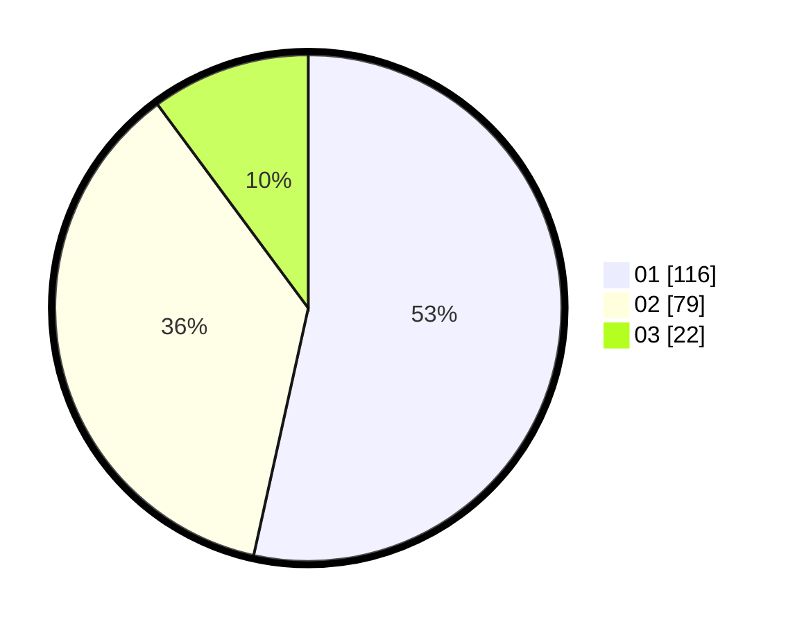

# Hasil

Hasil perolehan suara paslon dapat dilihat pada file paslon-01.txt, paslon-02.txt, dan paslon-03.txt.

Jika tidak ada, artinya data tersebut belum ada pada SIREKAP.

## Perolehan Suara

 * Paslon 01: **116**.
 * Paslon 02: **79**.
 * Paslon 03: **22**.

## Foto C Plano

https://sirekap-obj-formc.kpu.go.id/5540/pemilu/ppwp/31/73/06/10/02/3173061002047-20240214-155601--cad9f478-51d6-4ab1-b862-dfbedcd6e0dd.jpg

https://sirekap-obj-formc.kpu.go.id/5540/pemilu/ppwp/31/73/06/10/02/3173061002047-20240216-013512--0bf6d50f-aa0c-48af-a997-aea48496e879.jpg

https://sirekap-obj-formc.kpu.go.id/5540/pemilu/ppwp/31/73/06/10/02/3173061002047-20240214-155822--6e9e7aee-c977-4dc4-9dc4-d604d1b89473.jpg

## DATA PEMILIH TETAP

Jumlah pemilih dalam DPT: **275**.
 * L: **140**.
 * P: **135**.

## DATA PENGGUNA HAK PILIH

Jumlah pengguna hak pilih dalam DPT: **216**.
 * L: **108**.
 * P: **106**.

Jumlah pengguna hak pilih dalam DPTb: **0**.
 * L: **0**.
 * P: **0**.

Jumlah pengguna hak pilih dalam DPK: **5**.
 * L: **2**.
 * P: **3**.

Jumlah pengguna hak pilih: **214**.
 * L: **110**.
 * P: **104**.

## JUMLAH SUARA SAH DAN TIDAK SAH

JUMLAH SELURUH SUARA SAH: **217**.

JUMLAH SUARA TIDAK SAH: **2**.

JUMLAH SELURUH SUARA SAH DAN SUARA TIDAK SAH: **219**.
