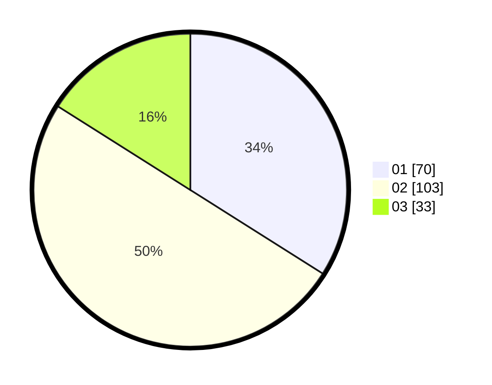

# Hasil

Hasil perolehan suara paslon dapat dilihat pada file paslon-01.txt, paslon-02.txt, dan paslon-03.txt.

Jika tidak ada, artinya data tersebut belum ada pada SIREKAP.

## Perolehan Suara

 * Paslon 01: **70**.
 * Paslon 02: **103**.
 * Paslon 03: **33**.

## Foto C Plano

https://sirekap-obj-formc.kpu.go.id/28c3/pemilu/ppwp/31/73/06/10/02/3173061002049-20240216-141425--d39e0829-fce2-4f36-827f-c7bf55c53191.jpg

https://sirekap-obj-formc.kpu.go.id/28c3/pemilu/ppwp/31/73/06/10/02/3173061002049-20240216-141426--2d5a3c0a-d842-4293-8f8e-cd0f11a6a394.jpg

https://sirekap-obj-formc.kpu.go.id/28c3/pemilu/ppwp/31/73/06/10/02/3173061002049-20240216-141425--4d2661bf-4816-4d94-a2be-95c398195acf.jpg

## DATA PEMILIH TETAP

Jumlah pemilih dalam DPT: **270**.
 * L: **137**.
 * P: **133**.

## DATA PENGGUNA HAK PILIH

Jumlah pengguna hak pilih dalam DPT: **201**.
 * L: **96**.
 * P: **105**.

Jumlah pengguna hak pilih dalam DPTb: **0**.
 * L: **0**.
 * P: **0**.

Jumlah pengguna hak pilih dalam DPK: **9**.
 * L: **5**.
 * P: **4**.

Jumlah pengguna hak pilih: **210**.
 * L: **101**.
 * P: **109**.

## JUMLAH SUARA SAH DAN TIDAK SAH

JUMLAH SELURUH SUARA SAH: **206**.

JUMLAH SUARA TIDAK SAH: **4**.

JUMLAH SELURUH SUARA SAH DAN SUARA TIDAK SAH: **210**.
