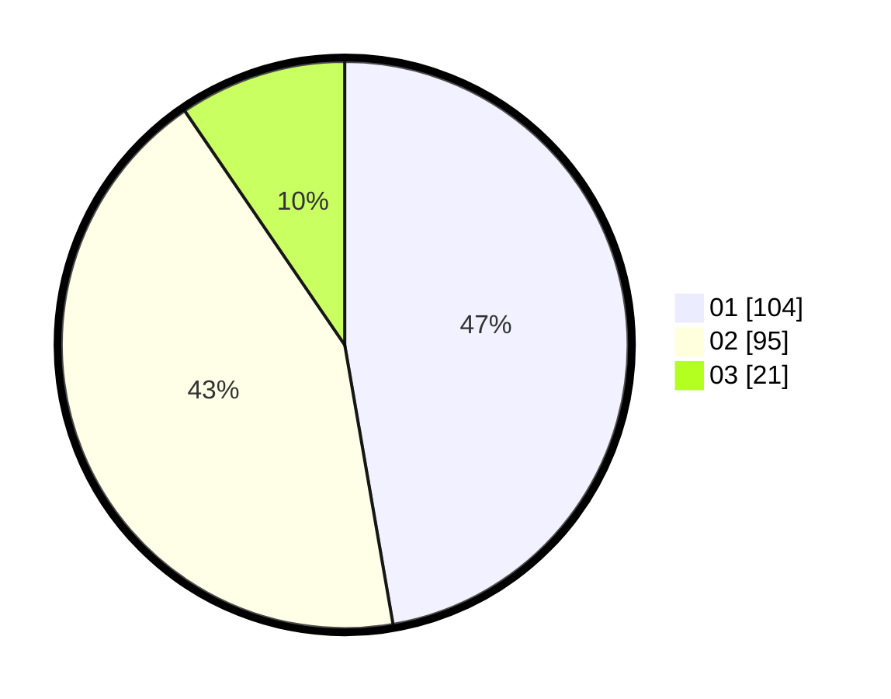

# Hasil

Hasil perolehan suara paslon dapat dilihat pada file paslon-01.txt, paslon-02.txt, dan paslon-03.txt.

Jika tidak ada, artinya data tersebut belum ada pada SIREKAP.

## Perolehan Suara

 * Paslon 01: **104**.
 * Paslon 02: **95**.
 * Paslon 03: **21**.

## Foto C Plano

https://sirekap-obj-formc.kpu.go.id/b022/pemilu/ppwp/31/73/06/10/02/3173061002050-20240215-013443--a2d95e7b-553e-4da9-b766-66d81ac22ea4.jpg

https://sirekap-obj-formc.kpu.go.id/b022/pemilu/ppwp/31/73/06/10/02/3173061002050-20240215-013710--38ccbe1b-50a3-4768-945a-f18b053d6082.jpg

https://sirekap-obj-formc.kpu.go.id/b022/pemilu/ppwp/31/73/06/10/02/3173061002050-20240215-013923--c56c9666-0275-430e-b255-99528a75350c.jpg

## DATA PEMILIH TETAP

Jumlah pemilih dalam DPT: **270**.
 * L: **145**.
 * P: **125**.

## DATA PENGGUNA HAK PILIH

Jumlah pengguna hak pilih dalam DPT: **221**.
 * L: **119**.
 * P: **102**.

Jumlah pengguna hak pilih dalam DPTb: **0**.
 * L: **0**.
 * P: **0**.

Jumlah pengguna hak pilih dalam DPK: **2**.
 * L: **2**.
 * P: **0**.

Jumlah pengguna hak pilih: **223**.
 * L: **121**.
 * P: **102**.

## JUMLAH SUARA SAH DAN TIDAK SAH

JUMLAH SELURUH SUARA SAH: **220**.

JUMLAH SUARA TIDAK SAH: **3**.

JUMLAH SELURUH SUARA SAH DAN SUARA TIDAK SAH: **223**.
