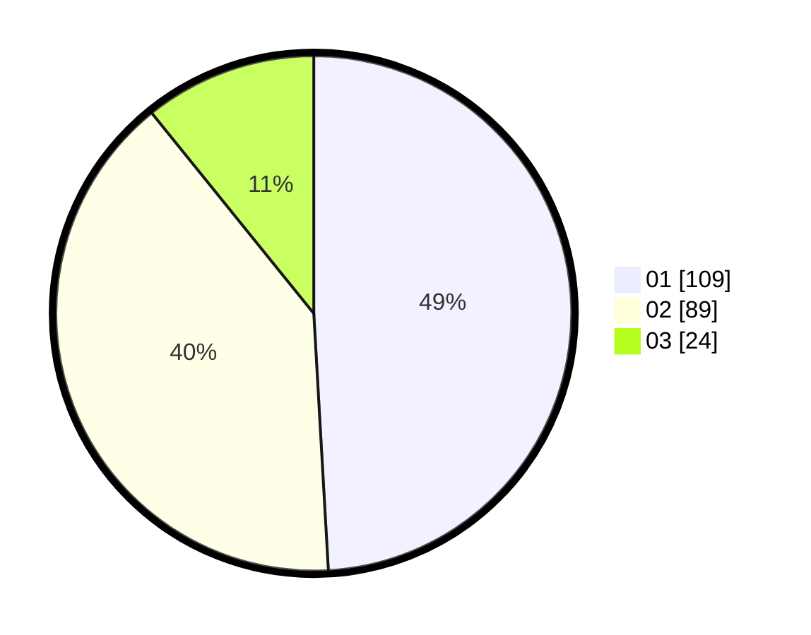

# Hasil

Hasil perolehan suara paslon dapat dilihat pada file paslon-01.txt, paslon-02.txt, dan paslon-03.txt.

Jika tidak ada, artinya data tersebut belum ada pada SIREKAP.

## Perolehan Suara

 * Paslon 01: **109**.
 * Paslon 02: **89**.
 * Paslon 03: **24**.

## Foto C Plano

https://sirekap-obj-formc.kpu.go.id/cb5c/pemilu/ppwp/31/73/06/10/02/3173061002052-20240214-230834--af46140f-535d-4716-a962-a31ab4b94764.jpg

https://sirekap-obj-formc.kpu.go.id/cb5c/pemilu/ppwp/31/73/06/10/02/3173061002052-20240214-231052--e6db08e5-8620-4682-bf1c-b72479598849.jpg

https://sirekap-obj-formc.kpu.go.id/cb5c/pemilu/ppwp/31/73/06/10/02/3173061002052-20240214-231549--6b8cead5-9836-45f9-ba17-210b2211d4c2.jpg
