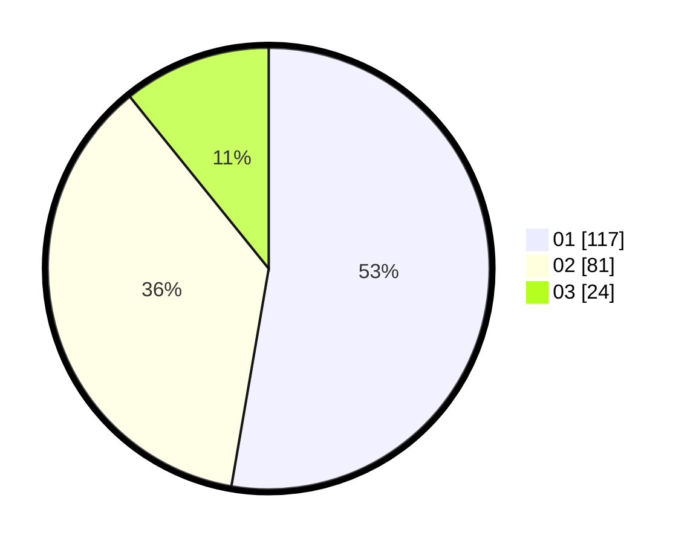

# Hasil

Hasil perolehan suara paslon dapat dilihat pada file paslon-01.txt, paslon-02.txt, dan paslon-03.txt.

Jika tidak ada, artinya data tersebut belum ada pada SIREKAP.

## Perolehan Suara

 * Paslon 01: **117**.
 * Paslon 02: **81**.
 * Paslon 03: **24**.

## Foto C Plano

https://sirekap-obj-formc.kpu.go.id/f0b4/pemilu/ppwp/31/73/06/10/02/3173061002056-20240214-191315--5cde4e44-9811-4564-a41d-076484ca809e.jpg

https://sirekap-obj-formc.kpu.go.id/f0b4/pemilu/ppwp/31/73/06/10/02/3173061002056-20240215-014008--e57c202e-0bf2-49fa-a4f7-2c737bd9f3c9.jpg

https://sirekap-obj-formc.kpu.go.id/f0b4/pemilu/ppwp/31/73/06/10/02/3173061002056-20240215-014142--ad68e6be-012a-4ed3-861d-cf7b268a3678.jpg
