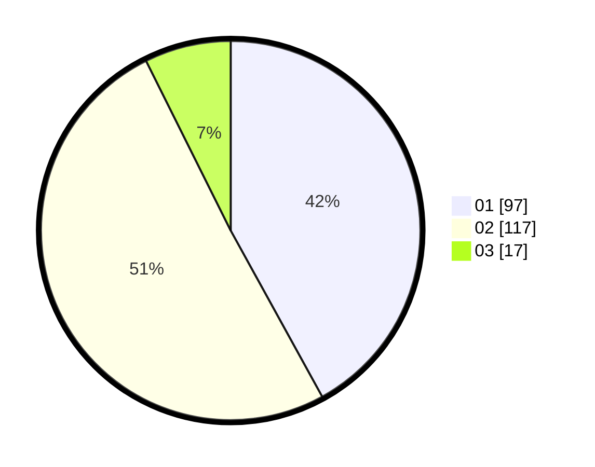

# Hasil

Hasil perolehan suara paslon dapat dilihat pada file paslon-01.txt, paslon-02.txt, dan paslon-03.txt.

Jika tidak ada, artinya data tersebut belum ada pada SIREKAP.

## Perolehan Suara

 * Paslon 01: **97**.
 * Paslon 02: **117**.
 * Paslon 03: **17**.

## Foto C Plano

https://sirekap-obj-formc.kpu.go.id/447d/pemilu/ppwp/31/73/06/10/02/3173061002060-20240215-002438--8f3787bb-e3c4-4e38-8bd9-86863ed1f9a2.jpg

https://sirekap-obj-formc.kpu.go.id/447d/pemilu/ppwp/31/73/06/10/02/3173061002060-20240215-002555--9d3b138e-4c29-49a8-af19-f63b17d02e9a.jpg

https://sirekap-obj-formc.kpu.go.id/447d/pemilu/ppwp/31/73/06/10/02/3173061002060-20240215-002837--0b699175-a38b-4c89-93a0-87b2ce8ebcff.jpg
