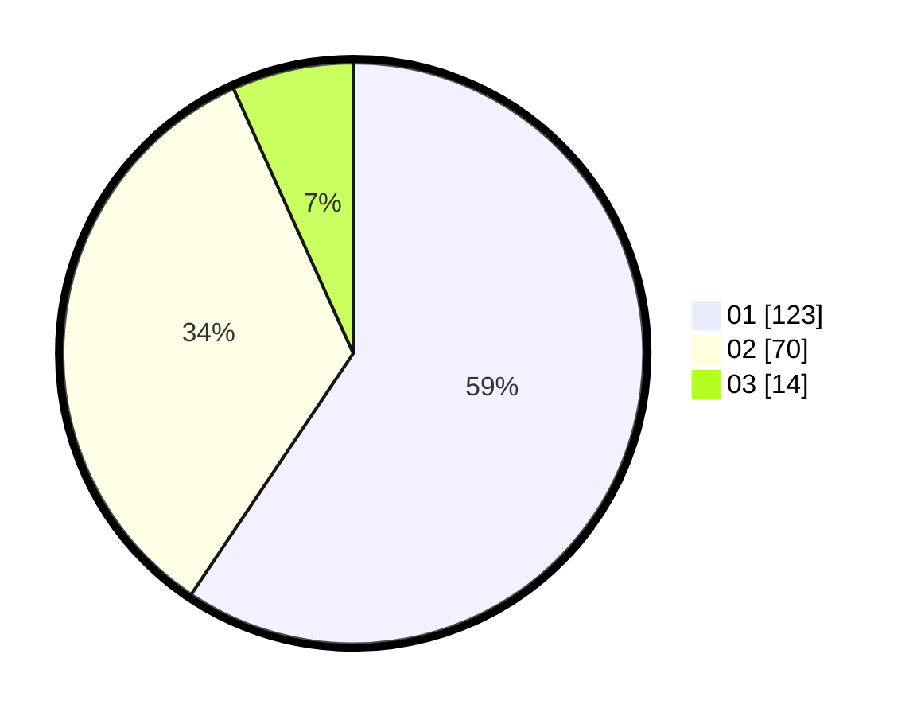

# Hasil

Hasil perolehan suara paslon dapat dilihat pada file paslon-01.txt, paslon-02.txt, dan paslon-03.txt.

Jika tidak ada, artinya data tersebut belum ada pada SIREKAP.

## Perolehan Suara

 * Paslon 01: **123**.
 * Paslon 02: **70**.
 * Paslon 03: **14**.

## Foto C Plano

https://sirekap-obj-formc.kpu.go.id/4173/pemilu/ppwp/31/73/06/10/02/3173061002064-20240214-232751--162352f2-bfd8-4246-90a0-5e5585f76b54.jpg

https://sirekap-obj-formc.kpu.go.id/4173/pemilu/ppwp/31/73/06/10/02/3173061002064-20240215-010128--611b5844-84e4-4117-9980-91c0652c2a6f.jpg

https://sirekap-obj-formc.kpu.go.id/4173/pemilu/ppwp/31/73/06/10/02/3173061002064-20240215-011240--bb9abd38-3ead-4b71-be7d-0fd7c59f9498.jpg
