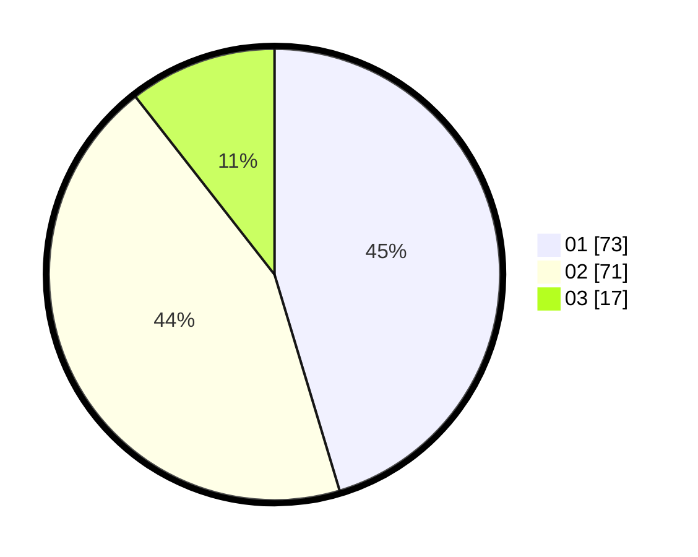

# Hasil

Hasil perolehan suara paslon dapat dilihat pada file paslon-01.txt, paslon-02.txt, dan paslon-03.txt.

Jika tidak ada, artinya data tersebut belum ada pada SIREKAP.

## Perolehan Suara

 * Paslon 01: **73**.
 * Paslon 02: **71**.
 * Paslon 03: **17**.

## Foto C Plano

https://sirekap-obj-formc.kpu.go.id/e1d3/pemilu/ppwp/31/73/06/10/02/3173061002067-20240214-185030--467aa94d-c63d-4714-865a-1fae87907281.jpg

https://sirekap-obj-formc.kpu.go.id/e1d3/pemilu/ppwp/31/73/06/10/02/3173061002067-20240214-185221--4cd2fee2-b1d2-4eb5-b50a-89c332e4145b.jpg

https://sirekap-obj-formc.kpu.go.id/e1d3/pemilu/ppwp/31/73/06/10/02/3173061002067-20240214-185334--0c917f8f-59a2-475e-8fbb-798fc8d81e34.jpg

## DATA PEMILIH TETAP

Jumlah pemilih dalam DPT: **231**.
 * L: **102**.
 * P: **129**.

## DATA PENGGUNA HAK PILIH

Jumlah pengguna hak pilih dalam DPT: **159**.
 * L: **67**.
 * P: **92**.

Jumlah pengguna hak pilih dalam DPTb: **0**.
 * L: **0**.
 * P: **0**.

Jumlah pengguna hak pilih dalam DPK: **5**.
 * L: **2**.
 * P: **3**.

Jumlah pengguna hak pilih: **164**.
 * L: **69**.
 * P: **95**.

## JUMLAH SUARA SAH DAN TIDAK SAH

JUMLAH SELURUH SUARA SAH: **161**.

JUMLAH SUARA TIDAK SAH: **3**.

JUMLAH SELURUH SUARA SAH DAN SUARA TIDAK SAH: **164**.
