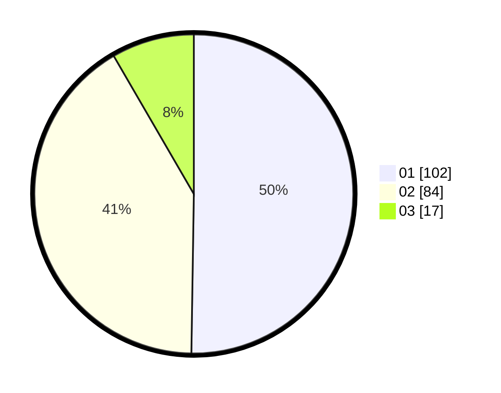

# Hasil

Hasil perolehan suara paslon dapat dilihat pada file paslon-01.txt, paslon-02.txt, dan paslon-03.txt.

Jika tidak ada, artinya data tersebut belum ada pada SIREKAP.

## Perolehan Suara

 * Paslon 01: **102**.
 * Paslon 02: **84**.
 * Paslon 03: **17**.

## Foto C Plano

https://sirekap-obj-formc.kpu.go.id/b09b/pemilu/ppwp/31/73/06/10/02/3173061002069-20240215-030120--a4447291-1705-4ed4-a5a1-5d61bee3bf2a.jpg

https://sirekap-obj-formc.kpu.go.id/b09b/pemilu/ppwp/31/73/06/10/02/3173061002069-20240215-030246--dd267d8e-dea3-4f82-9d83-b78055867495.jpg

https://sirekap-obj-formc.kpu.go.id/b09b/pemilu/ppwp/31/73/06/10/02/3173061002069-20240215-030358--eb4f964b-8574-4a73-ae94-7359a2caa145.jpg
