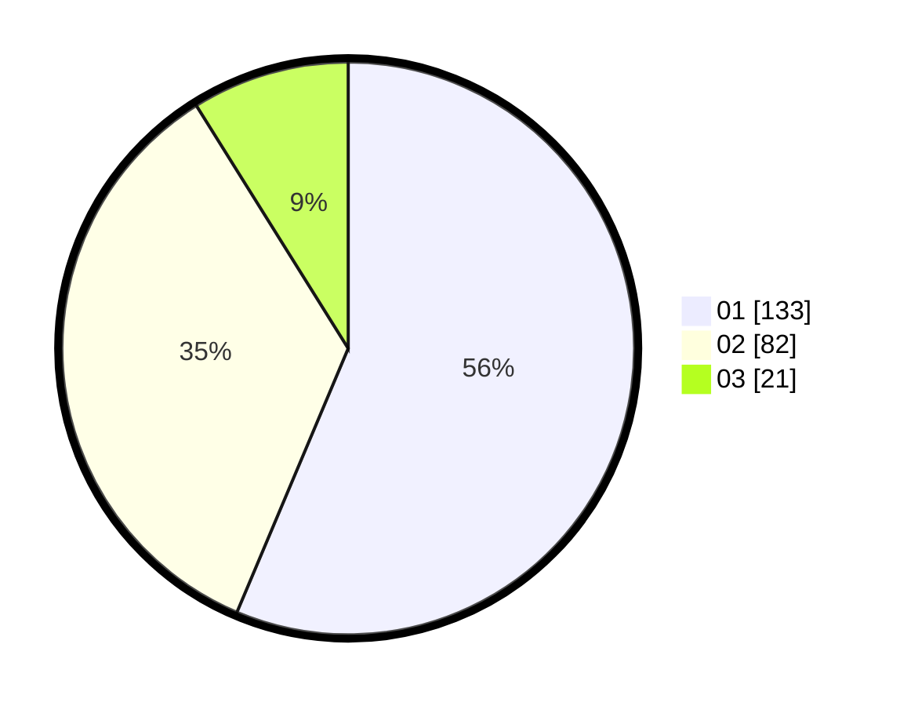

# Hasil

Hasil perolehan suara paslon dapat dilihat pada file paslon-01.txt, paslon-02.txt, dan paslon-03.txt.

Jika tidak ada, artinya data tersebut belum ada pada SIREKAP.

## Perolehan Suara

 * Paslon 01: **133**.
 * Paslon 02: **82**.
 * Paslon 03: **21**.

## Foto C Plano

https://sirekap-obj-formc.kpu.go.id/5574/pemilu/ppwp/31/73/06/10/02/3173061002070-20240214-234629--ad20c18e-aa97-4c94-9013-8d890ab73e4a.jpg

https://sirekap-obj-formc.kpu.go.id/5574/pemilu/ppwp/31/73/06/10/02/3173061002070-20240214-234612--e74e9ce6-5049-40bc-bdd5-6c2366f21bce.jpg

https://sirekap-obj-formc.kpu.go.id/5574/pemilu/ppwp/31/73/06/10/02/3173061002070-20240214-234555--3cb41528-4cea-44f4-91cd-779165ce0f66.jpg
