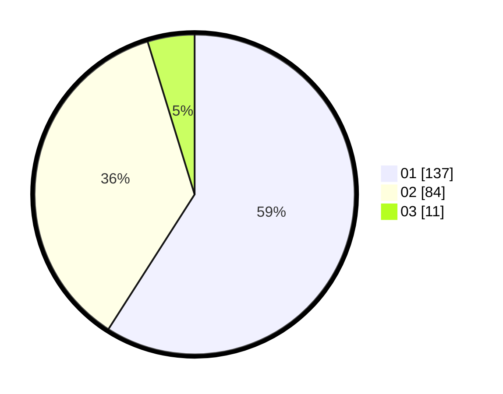

# Hasil

Hasil perolehan suara paslon dapat dilihat pada file paslon-01.txt, paslon-02.txt, dan paslon-03.txt.

Jika tidak ada, artinya data tersebut belum ada pada SIREKAP.

## Perolehan Suara

 * Paslon 01: **137**.
 * Paslon 02: **84**.
 * Paslon 03: **11**.

## Foto C Plano

https://sirekap-obj-formc.kpu.go.id/5f6f/pemilu/ppwp/31/73/06/10/02/3173061002071-20240214-210439--04c96fda-edf3-4936-8f47-cf8eca01d7e0.jpg

https://sirekap-obj-formc.kpu.go.id/5f6f/pemilu/ppwp/31/73/06/10/02/3173061002071-20240214-210549--b835856d-3351-4e1b-88fb-da263a3fc5b6.jpg

https://sirekap-obj-formc.kpu.go.id/5f6f/pemilu/ppwp/31/73/06/10/02/3173061002071-20240214-211443--4fe46f70-8800-475c-85db-b88f8f7ae5b8.jpg
