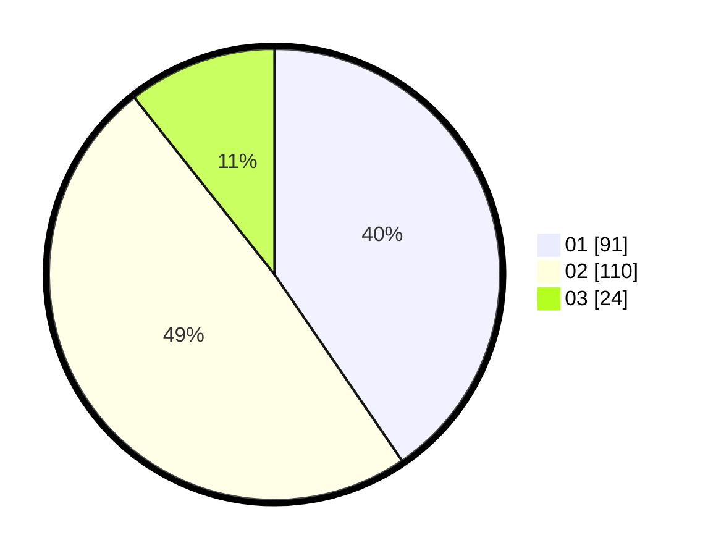

# Hasil

Hasil perolehan suara paslon dapat dilihat pada file paslon-01.txt, paslon-02.txt, dan paslon-03.txt.

Jika tidak ada, artinya data tersebut belum ada pada SIREKAP.

## Perolehan Suara

 * Paslon 01: **91**.
 * Paslon 02: **110**.
 * Paslon 03: **24**.

## Foto C Plano

https://sirekap-obj-formc.kpu.go.id/c336/pemilu/ppwp/31/73/06/10/02/3173061002076-20240214-225506--e2736ae0-0f92-4e48-a020-be29a0ca13de.jpg

https://sirekap-obj-formc.kpu.go.id/c336/pemilu/ppwp/31/73/06/10/02/3173061002076-20240214-225612--6eea1821-b625-4bcb-b7b8-be098a6d048a.jpg

https://sirekap-obj-formc.kpu.go.id/c336/pemilu/ppwp/31/73/06/10/02/3173061002076-20240214-225647--17808d31-0387-4ed3-b4c0-0dca821b8012.jpg
