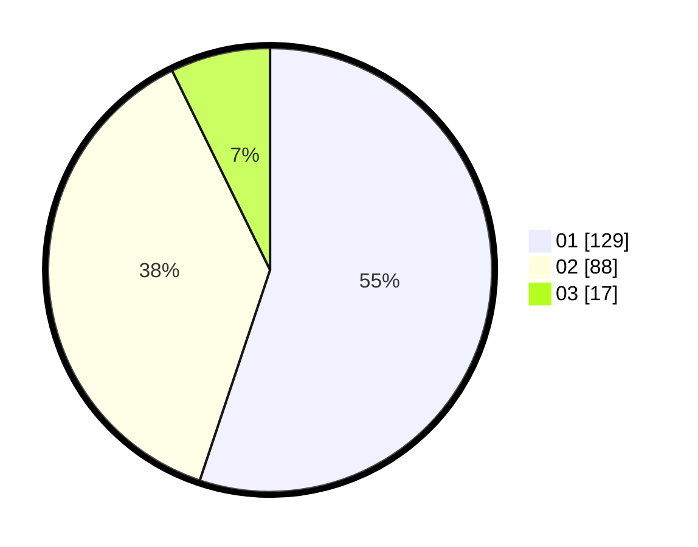

# Hasil

Hasil perolehan suara paslon dapat dilihat pada file paslon-01.txt, paslon-02.txt, dan paslon-03.txt.

Jika tidak ada, artinya data tersebut belum ada pada SIREKAP.

## Perolehan Suara

 * Paslon 01: **129**.
 * Paslon 02: **88**.
 * Paslon 03: **17**.

## Foto C Plano

https://sirekap-obj-formc.kpu.go.id/1fb6/pemilu/ppwp/31/73/06/10/02/3173061002077-20240214-200436--9ec65ccb-d669-4bde-b956-5e84fed7fbfd.jpg

https://sirekap-obj-formc.kpu.go.id/1fb6/pemilu/ppwp/31/73/06/10/02/3173061002077-20240214-200329--13c53a19-cdec-471b-9f8f-4ad11b79f073.jpg

https://sirekap-obj-formc.kpu.go.id/1fb6/pemilu/ppwp/31/73/06/10/02/3173061002077-20240214-200217--aa981e47-c675-430f-9175-7091630d8baa.jpg
