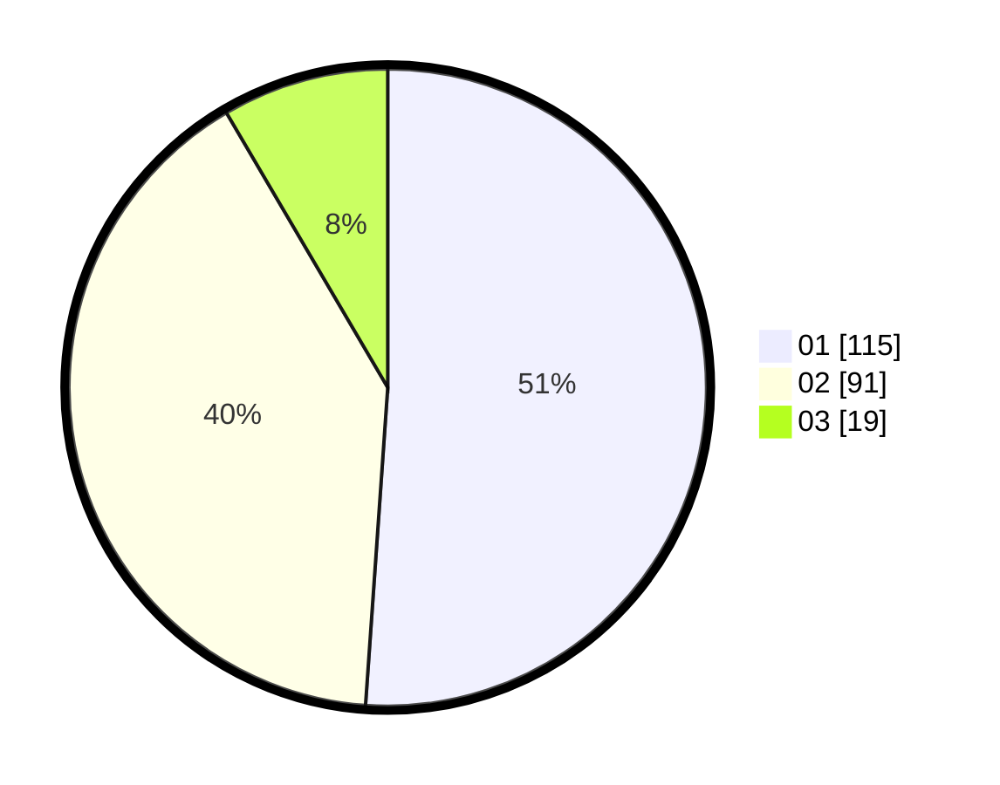

# Hasil

Hasil perolehan suara paslon dapat dilihat pada file paslon-01.txt, paslon-02.txt, dan paslon-03.txt.

Jika tidak ada, artinya data tersebut belum ada pada SIREKAP.

## Perolehan Suara

 * Paslon 01: **115**.
 * Paslon 02: **91**.
 * Paslon 03: **19**.

## Foto C Plano

https://sirekap-obj-formc.kpu.go.id/1860/pemilu/ppwp/31/73/06/10/02/3173061002081-20240214-221051--c9d51c86-3a41-4964-9f86-b60e79e9acc3.jpg

https://sirekap-obj-formc.kpu.go.id/1860/pemilu/ppwp/31/73/06/10/02/3173061002081-20240214-213237--184d7f61-7564-41ee-a3c0-a417ba1fe35e.jpg

https://sirekap-obj-formc.kpu.go.id/1860/pemilu/ppwp/31/73/06/10/02/3173061002081-20240214-221255--f1ff1a3e-0491-4753-8d6c-c92bec0796b8.jpg

## DATA PEMILIH TETAP

Jumlah pemilih dalam DPT: **275**.
 * L: **145**.
 * P: **130**.

## DATA PENGGUNA HAK PILIH

Jumlah pengguna hak pilih dalam DPT: **224**.
 * L: **115**.
 * P: **109**.

Jumlah pengguna hak pilih dalam DPTb: **0**.
 * L: **0**.
 * P: **0**.

Jumlah pengguna hak pilih dalam DPK: **5**.
 * L: **1**.
 * P: **4**.

Jumlah pengguna hak pilih: **229**.
 * L: **116**.
 * P: **113**.

## JUMLAH SUARA SAH DAN TIDAK SAH

JUMLAH SELURUH SUARA SAH: **225**.

JUMLAH SUARA TIDAK SAH: **4**.

JUMLAH SELURUH SUARA SAH DAN SUARA TIDAK SAH: **229**.
