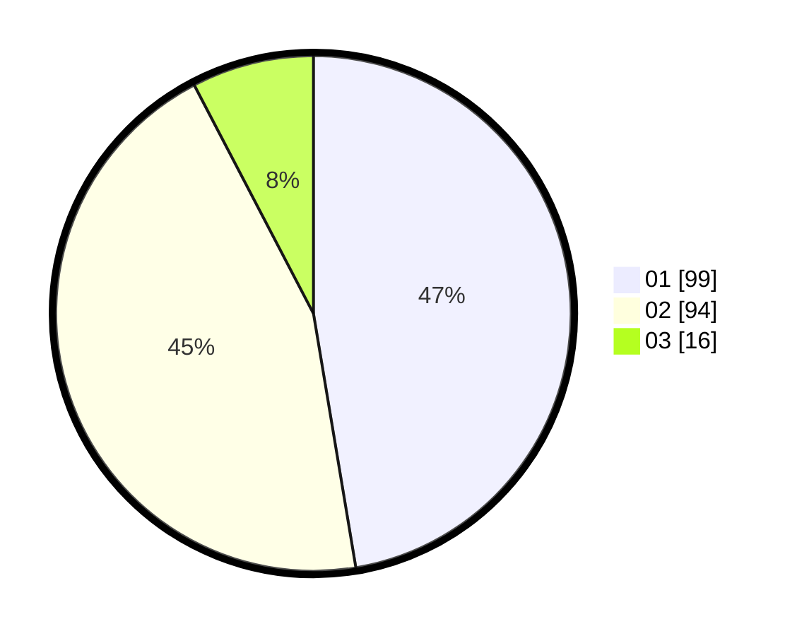

# Hasil

Hasil perolehan suara paslon dapat dilihat pada file paslon-01.txt, paslon-02.txt, dan paslon-03.txt.

Jika tidak ada, artinya data tersebut belum ada pada SIREKAP.

## Perolehan Suara

 * Paslon 01: **99**.
 * Paslon 02: **94**.
 * Paslon 03: **16**.

## Foto C Plano

https://sirekap-obj-formc.kpu.go.id/3ce6/pemilu/ppwp/31/73/06/10/02/3173061002082-20240214-204101--dc012d64-8ca8-4ff8-949b-8397ec10f003.jpg

https://sirekap-obj-formc.kpu.go.id/3ce6/pemilu/ppwp/31/73/06/10/02/3173061002082-20240214-204325--e12ad81f-8f2a-45b4-8c77-e712df5e7440.jpg

https://sirekap-obj-formc.kpu.go.id/3ce6/pemilu/ppwp/31/73/06/10/02/3173061002082-20240214-215604--0a7494d7-82fd-44fe-ae71-c5a3880e2e03.jpg

## DATA PEMILIH TETAP

Jumlah pemilih dalam DPT: **274**.
 * L: **133**.
 * P: **141**.

## DATA PENGGUNA HAK PILIH

Jumlah pengguna hak pilih dalam DPT: **211**.
 * L: **99**.
 * P: **112**.

Jumlah pengguna hak pilih dalam DPTb: **4**.
 * L: **2**.
 * P: **2**.

Jumlah pengguna hak pilih dalam DPK: **0**.
 * L: **0**.
 * P: **0**.

Jumlah pengguna hak pilih: **215**.
 * L: **101**.
 * P: **114**.

## JUMLAH SUARA SAH DAN TIDAK SAH

JUMLAH SELURUH SUARA SAH: **209**.

JUMLAH SUARA TIDAK SAH: **6**.

JUMLAH SELURUH SUARA SAH DAN SUARA TIDAK SAH: **215**.
