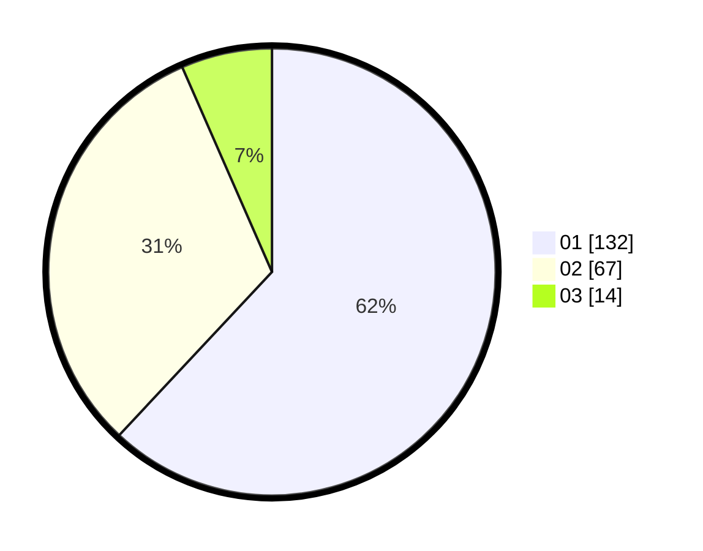

# Hasil

Hasil perolehan suara paslon dapat dilihat pada file paslon-01.txt, paslon-02.txt, dan paslon-03.txt.

Jika tidak ada, artinya data tersebut belum ada pada SIREKAP.

## Perolehan Suara

 * Paslon 01: **132**.
 * Paslon 02: **67**.
 * Paslon 03: **14**.

## Foto C Plano

https://sirekap-obj-formc.kpu.go.id/6a95/pemilu/ppwp/31/73/06/10/02/3173061002085-20240214-155238--b83d4514-46d6-4404-8431-250b885e63b3.jpg

https://sirekap-obj-formc.kpu.go.id/6a95/pemilu/ppwp/31/73/06/10/02/3173061002085-20240214-155246--49d69e27-b083-4bb4-a1df-9a8b4f648873.jpg

https://sirekap-obj-formc.kpu.go.id/6a95/pemilu/ppwp/31/73/06/10/02/3173061002085-20240214-155252--983fdcaa-30ae-4e5d-98a3-ee46860d3b1e.jpg
