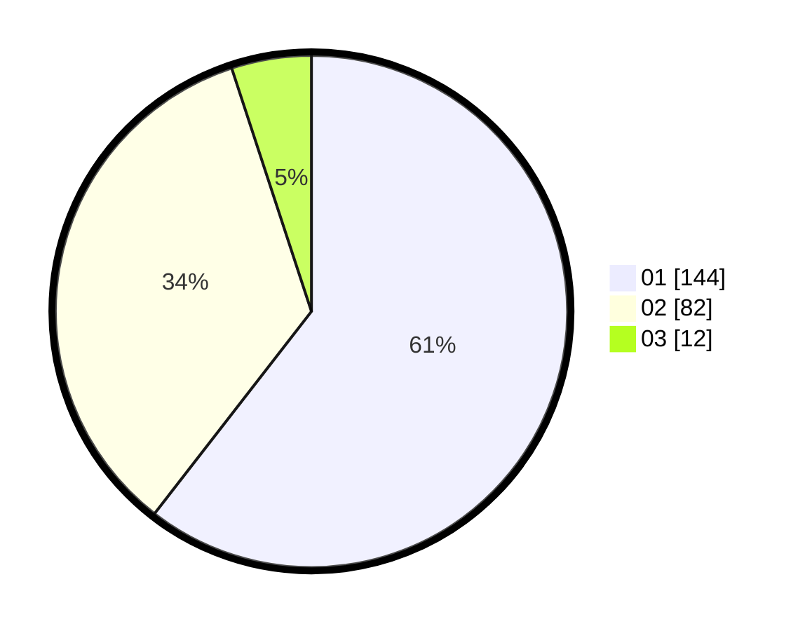

# Hasil

Hasil perolehan suara paslon dapat dilihat pada file paslon-01.txt, paslon-02.txt, dan paslon-03.txt.

Jika tidak ada, artinya data tersebut belum ada pada SIREKAP.

## Perolehan Suara

 * Paslon 01: **144**.
 * Paslon 02: **82**.
 * Paslon 03: **12**.

## Foto C Plano

https://sirekap-obj-formc.kpu.go.id/9f40/pemilu/ppwp/31/73/06/10/02/3173061002086-20240214-215953--4df32081-df4f-47be-b475-97189943e002.jpg

https://sirekap-obj-formc.kpu.go.id/9f40/pemilu/ppwp/31/73/06/10/02/3173061002086-20240215-024707--c7288186-0c45-4c5e-80c5-5ef85d67ad67.jpg

https://sirekap-obj-formc.kpu.go.id/9f40/pemilu/ppwp/31/73/06/10/02/3173061002086-20240215-024402--b09707b3-4db7-409b-a43a-9d01c5ffba3c.jpg
