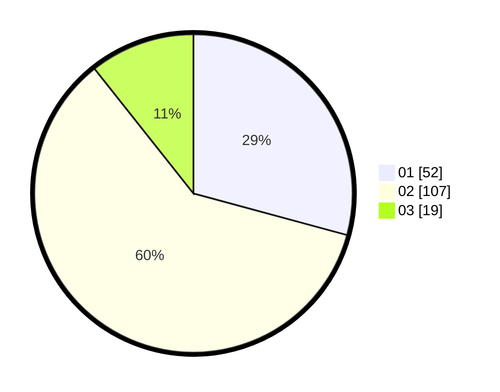

# Hasil

Hasil perolehan suara paslon dapat dilihat pada file paslon-01.txt, paslon-02.txt, dan paslon-03.txt.

Jika tidak ada, artinya data tersebut belum ada pada SIREKAP.

## Perolehan Suara

 * Paslon 01: **52**.
 * Paslon 02: **107**.
 * Paslon 03: **19**.

## Foto C Plano

https://sirekap-obj-formc.kpu.go.id/753f/pemilu/ppwp/31/73/06/10/02/3173061002088-20240214-230841--10e8a56f-6c4b-45c8-ba9e-bb7541651943.jpg

https://sirekap-obj-formc.kpu.go.id/753f/pemilu/ppwp/31/73/06/10/02/3173061002088-20240214-231100--19a75f17-47fb-40b7-ba53-9aefaa7e036f.jpg

https://sirekap-obj-formc.kpu.go.id/753f/pemilu/ppwp/31/73/06/10/02/3173061002088-20240214-231236--fe73d39b-f537-44ce-9083-aeb7aab4b3e1.jpg
