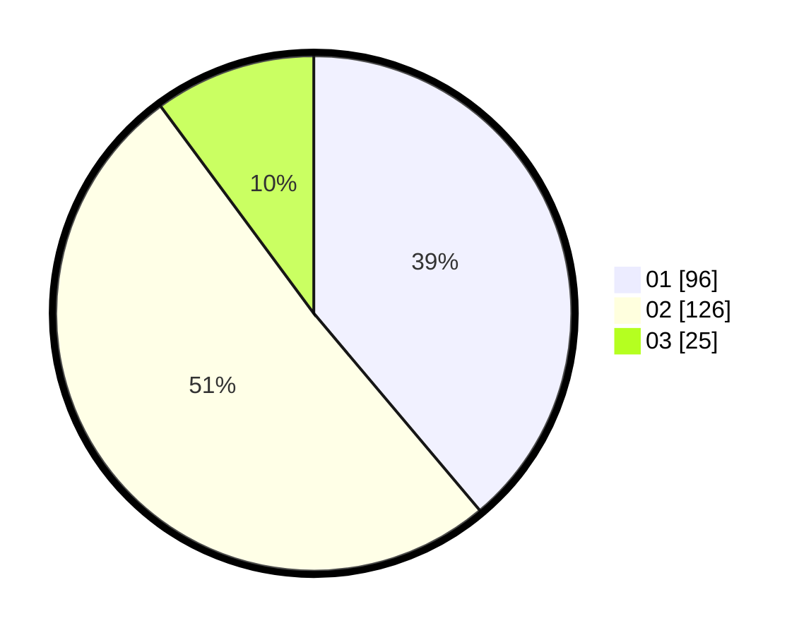

# Hasil

Hasil perolehan suara paslon dapat dilihat pada file paslon-01.txt, paslon-02.txt, dan paslon-03.txt.

Jika tidak ada, artinya data tersebut belum ada pada SIREKAP.

## Perolehan Suara

 * Paslon 01: **96**.
 * Paslon 02: **126**.
 * Paslon 03: **25**.

## Foto C Plano

https://sirekap-obj-formc.kpu.go.id/7735/pemilu/ppwp/31/73/06/10/02/3173061002091-20240214-221130--66884416-effa-43ec-aa7d-4a2a4d84630b.jpg

https://sirekap-obj-formc.kpu.go.id/7735/pemilu/ppwp/31/73/06/10/02/3173061002091-20240214-202743--fa87ce05-2595-49a3-ac16-b65c513c1cad.jpg

https://sirekap-obj-formc.kpu.go.id/7735/pemilu/ppwp/31/73/06/10/02/3173061002091-20240214-203537--6ed5ddab-c2f9-4977-841b-5e73d4a023e4.jpg

## DATA PEMILIH TETAP

Jumlah pemilih dalam DPT: **278**.
 * L: **142**.
 * P: **136**.

## DATA PENGGUNA HAK PILIH

Jumlah pengguna hak pilih dalam DPT: **247**.
 * L: **123**.
 * P: **124**.

Jumlah pengguna hak pilih dalam DPTb: **2**.
 * L: **1**.
 * P: **1**.

Jumlah pengguna hak pilih dalam DPK: **3**.
 * L: **3**.
 * P: **0**.

Jumlah pengguna hak pilih: **252**.
 * L: **127**.
 * P: **125**.

## JUMLAH SUARA SAH DAN TIDAK SAH

JUMLAH SELURUH SUARA SAH: **247**.

JUMLAH SUARA TIDAK SAH: **5**.

JUMLAH SELURUH SUARA SAH DAN SUARA TIDAK SAH: **252**.
