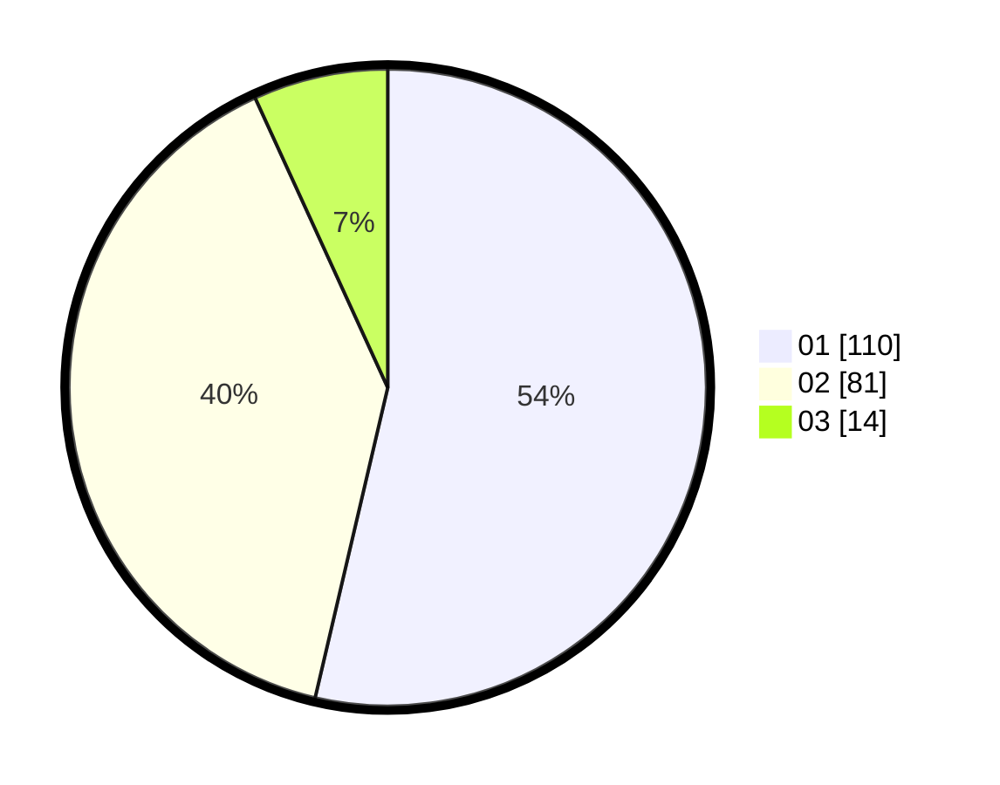

# Hasil

Hasil perolehan suara paslon dapat dilihat pada file paslon-01.txt, paslon-02.txt, dan paslon-03.txt.

Jika tidak ada, artinya data tersebut belum ada pada SIREKAP.

## Perolehan Suara

 * Paslon 01: **110**.
 * Paslon 02: **81**.
 * Paslon 03: **14**.

## Foto C Plano

https://sirekap-obj-formc.kpu.go.id/730d/pemilu/ppwp/31/73/06/10/02/3173061002096-20240214-194008--f59597a2-e2a3-4af4-95cc-9f20e78f558c.jpg

https://sirekap-obj-formc.kpu.go.id/730d/pemilu/ppwp/31/73/06/10/02/3173061002096-20240214-194111--5629b550-5542-4129-ae5c-f146e3cdd691.jpg

https://sirekap-obj-formc.kpu.go.id/730d/pemilu/ppwp/31/73/06/10/02/3173061002096-20240214-193829--0fc92634-67dc-48a9-9c84-a18fdeb79d5b.jpg
