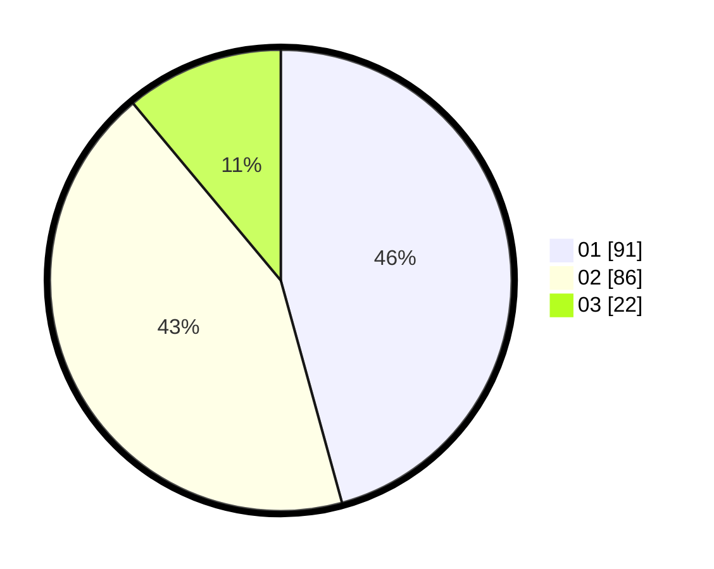

# Hasil

Hasil perolehan suara paslon dapat dilihat pada file paslon-01.txt, paslon-02.txt, dan paslon-03.txt.

Jika tidak ada, artinya data tersebut belum ada pada SIREKAP.

## Perolehan Suara

 * Paslon 01: **91**.
 * Paslon 02: **86**.
 * Paslon 03: **22**.

## Foto C Plano

https://sirekap-obj-formc.kpu.go.id/972e/pemilu/ppwp/31/73/06/10/02/3173061002098-20240214-220801--52ff9ab2-0ffa-493d-8967-66f2482c5236.jpg

https://sirekap-obj-formc.kpu.go.id/972e/pemilu/ppwp/31/73/06/10/02/3173061002098-20240214-220923--1237043e-ba7a-4a5a-b991-495b83545c86.jpg

https://sirekap-obj-formc.kpu.go.id/972e/pemilu/ppwp/31/73/06/10/02/3173061002098-20240215-024519--cd491f84-f563-4692-a5ae-b5406b798ef7.jpg

## DATA PEMILIH TETAP

Jumlah pemilih dalam DPT: **260**.
 * L: **141**.
 * P: **119**.

## DATA PENGGUNA HAK PILIH

Jumlah pengguna hak pilih dalam DPT: **199**.
 * L: **105**.
 * P: **94**.

Jumlah pengguna hak pilih dalam DPTb: **2**.
 * L: **2**.
 * P: **0**.

Jumlah pengguna hak pilih dalam DPK: **0**.
 * L: **0**.
 * P: **0**.

Jumlah pengguna hak pilih: **201**.
 * L: **107**.
 * P: **94**.

## JUMLAH SUARA SAH DAN TIDAK SAH

JUMLAH SELURUH SUARA SAH: **199**.

JUMLAH SUARA TIDAK SAH: **2**.

JUMLAH SELURUH SUARA SAH DAN SUARA TIDAK SAH: **201**.
