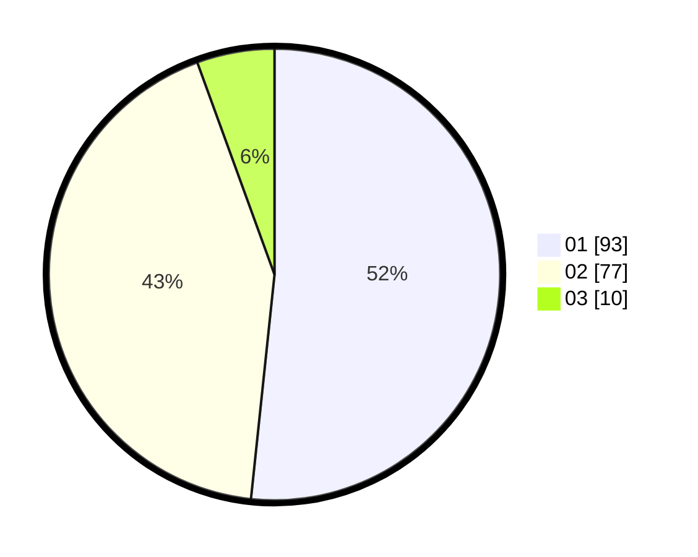

# Hasil

Hasil perolehan suara paslon dapat dilihat pada file paslon-01.txt, paslon-02.txt, dan paslon-03.txt.

Jika tidak ada, artinya data tersebut belum ada pada SIREKAP.

## Perolehan Suara

 * Paslon 01: **93**.
 * Paslon 02: **77**.
 * Paslon 03: **10**.

## Foto C Plano

https://sirekap-obj-formc.kpu.go.id/8d40/pemilu/ppwp/31/73/06/10/02/3173061002099-20240214-220157--529dfa8c-8cb2-4152-8f4e-bfdebe3f3e1c.jpg

https://sirekap-obj-formc.kpu.go.id/8d40/pemilu/ppwp/31/73/06/10/02/3173061002099-20240214-220229--27655fa9-b004-43f6-8a50-8d24d0eb6650.jpg

https://sirekap-obj-formc.kpu.go.id/8d40/pemilu/ppwp/31/73/06/10/02/3173061002099-20240214-220420--f92ae863-a0d4-41af-b568-e9e601c42803.jpg
