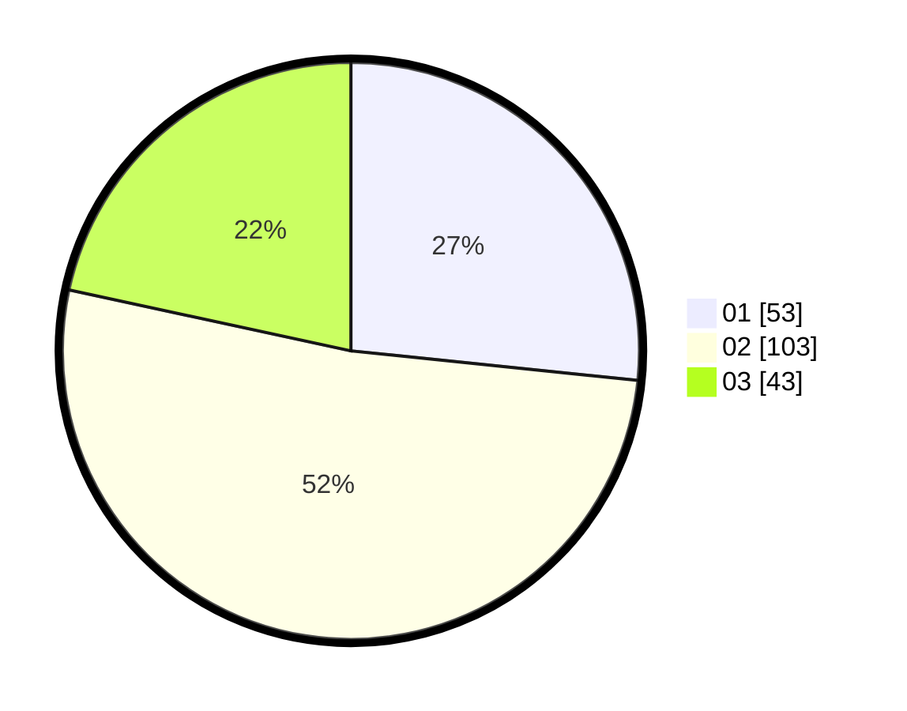

# Hasil

Hasil perolehan suara paslon dapat dilihat pada file paslon-01.txt, paslon-02.txt, dan paslon-03.txt.

Jika tidak ada, artinya data tersebut belum ada pada SIREKAP.

## Perolehan Suara

 * Paslon 01: **53**.
 * Paslon 02: **103**.
 * Paslon 03: **43**.

## Foto C Plano

https://sirekap-obj-formc.kpu.go.id/72be/pemilu/ppwp/31/73/06/10/02/3173061002110-20240214-222127--b68870ac-81ae-48f0-b80e-56acd12d7e29.jpg

https://sirekap-obj-formc.kpu.go.id/72be/pemilu/ppwp/31/73/06/10/02/3173061002110-20240214-222255--dd24edc2-5bf9-4bef-af22-6328df94a416.jpg

https://sirekap-obj-formc.kpu.go.id/72be/pemilu/ppwp/31/73/06/10/02/3173061002110-20240214-230113--cf8f5caf-c165-4b85-96b2-32de6d45a130.jpg
