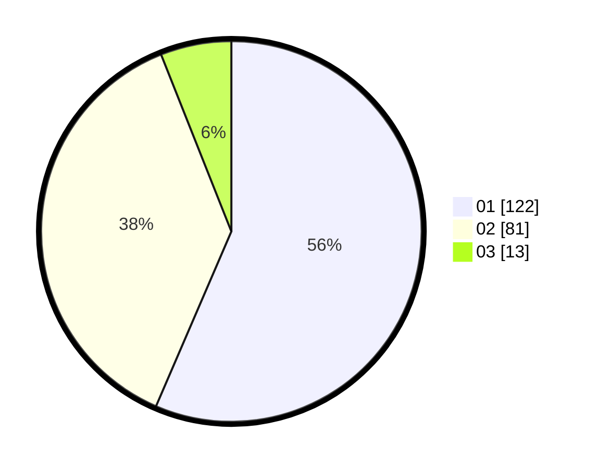

# Hasil

Hasil perolehan suara paslon dapat dilihat pada file paslon-01.txt, paslon-02.txt, dan paslon-03.txt.

Jika tidak ada, artinya data tersebut belum ada pada SIREKAP.

## Perolehan Suara

 * Paslon 01: **122**.
 * Paslon 02: **81**.
 * Paslon 03: **13**.

## Foto C Plano

https://sirekap-obj-formc.kpu.go.id/4841/pemilu/ppwp/31/73/06/10/02/3173061002113-20240214-155905--f152e486-985e-42a9-8c32-f74a2c9041d4.jpg

https://sirekap-obj-formc.kpu.go.id/4841/pemilu/ppwp/31/73/06/10/02/3173061002113-20240214-200336--b9e25f42-04ee-425d-a795-30d25a0e2383.jpg

https://sirekap-obj-formc.kpu.go.id/4841/pemilu/ppwp/31/73/06/10/02/3173061002113-20240214-155814--0bd643ac-1fdb-4c08-ae68-8a0d2a78efd1.jpg

## DATA PEMILIH TETAP

Jumlah pemilih dalam DPT: **272**.
 * L: **136**.
 * P: **136**.

## DATA PENGGUNA HAK PILIH

Jumlah pengguna hak pilih dalam DPT: **214**.
 * L: **102**.
 * P: **112**.

Jumlah pengguna hak pilih dalam DPTb: **0**.
 * L: **0**.
 * P: **0**.

Jumlah pengguna hak pilih dalam DPK: **3**.
 * L: **2**.
 * P: **1**.

Jumlah pengguna hak pilih: **217**.
 * L: **104**.
 * P: **113**.

## JUMLAH SUARA SAH DAN TIDAK SAH

JUMLAH SELURUH SUARA SAH: **216**.

JUMLAH SUARA TIDAK SAH: **1**.

JUMLAH SELURUH SUARA SAH DAN SUARA TIDAK SAH: **217**.
