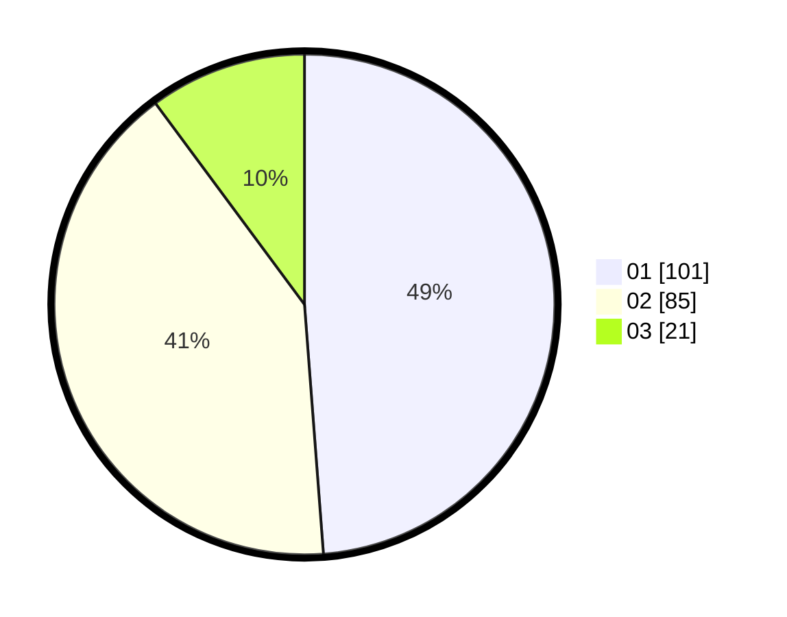

# Hasil

Hasil perolehan suara paslon dapat dilihat pada file paslon-01.txt, paslon-02.txt, dan paslon-03.txt.

Jika tidak ada, artinya data tersebut belum ada pada SIREKAP.

## Perolehan Suara

 * Paslon 01: **101**.
 * Paslon 02: **85**.
 * Paslon 03: **21**.

## Foto C Plano

https://sirekap-obj-formc.kpu.go.id/5627/pemilu/ppwp/31/73/06/10/02/3173061002117-20240214-214531--166dbf8e-be28-4a80-b507-99870dfddd07.jpg

https://sirekap-obj-formc.kpu.go.id/5627/pemilu/ppwp/31/73/06/10/02/3173061002117-20240214-214812--36666199-f0ca-4763-ade1-b5a23f64d3a6.jpg

https://sirekap-obj-formc.kpu.go.id/5627/pemilu/ppwp/31/73/06/10/02/3173061002117-20240214-214846--2c1f8153-ab8e-43ca-9877-b7ef4145e9d0.jpg
