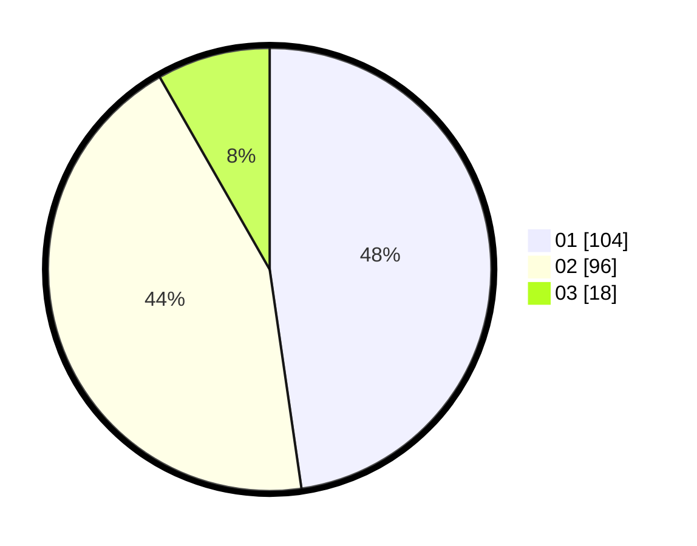

# Hasil

Hasil perolehan suara paslon dapat dilihat pada file paslon-01.txt, paslon-02.txt, dan paslon-03.txt.

Jika tidak ada, artinya data tersebut belum ada pada SIREKAP.

## Perolehan Suara

 * Paslon 01: **104**.
 * Paslon 02: **96**.
 * Paslon 03: **18**.

## Foto C Plano

https://sirekap-obj-formc.kpu.go.id/cce6/pemilu/ppwp/31/73/06/10/02/3173061002120-20240216-134831--5d275021-0815-4c78-b8e8-8b76582a05b0.jpg

https://sirekap-obj-formc.kpu.go.id/cce6/pemilu/ppwp/31/73/06/10/02/3173061002120-20240216-134832--875194f9-dcd3-4110-887a-f6e66dab999d.jpg

https://sirekap-obj-formc.kpu.go.id/cce6/pemilu/ppwp/31/73/06/10/02/3173061002120-20240216-134832--9760426f-2030-4714-82ec-ae77f58df348.jpg

## DATA PEMILIH TETAP

Jumlah pemilih dalam DPT: **270**.
 * L: **124**.
 * P: **146**.

## DATA PENGGUNA HAK PILIH

Jumlah pengguna hak pilih dalam DPT: **220**.
 * L: **100**.
 * P: **120**.

Jumlah pengguna hak pilih dalam DPTb: **0**.
 * L: **0**.
 * P: **0**.

Jumlah pengguna hak pilih dalam DPK: **1**.
 * L: **0**.
 * P: **1**.

Jumlah pengguna hak pilih: **221**.
 * L: **100**.
 * P: **121**.

## JUMLAH SUARA SAH DAN TIDAK SAH

JUMLAH SELURUH SUARA SAH: **218**.

JUMLAH SUARA TIDAK SAH: **3**.

JUMLAH SELURUH SUARA SAH DAN SUARA TIDAK SAH: **221**.
