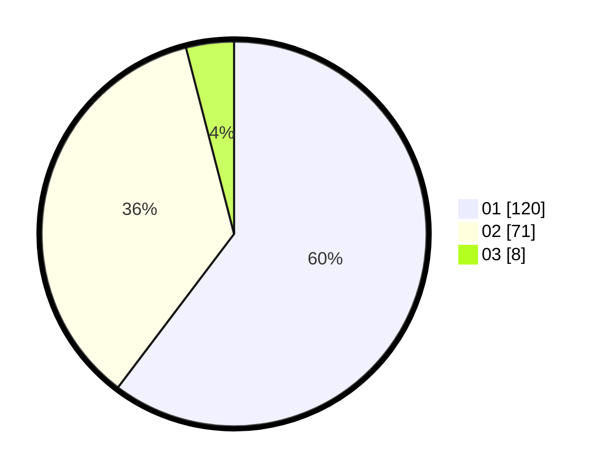

# Hasil

Hasil perolehan suara paslon dapat dilihat pada file paslon-01.txt, paslon-02.txt, dan paslon-03.txt.

Jika tidak ada, artinya data tersebut belum ada pada SIREKAP.

## Perolehan Suara

 * Paslon 01: **120**.
 * Paslon 02: **71**.
 * Paslon 03: **8**.

## Foto C Plano

https://sirekap-obj-formc.kpu.go.id/8ec2/pemilu/ppwp/31/73/06/10/02/3173061002123-20240215-042104--e2f5a4f8-8529-40b9-b3ae-a7ff4cfdc3dd.jpg

https://sirekap-obj-formc.kpu.go.id/8ec2/pemilu/ppwp/31/73/06/10/02/3173061002123-20240215-042208--6efcac27-6b6d-46b0-aa03-7e54eda42673.jpg

https://sirekap-obj-formc.kpu.go.id/8ec2/pemilu/ppwp/31/73/06/10/02/3173061002123-20240215-042401--6fc616f1-744b-40a6-b7b3-6b9ac680f91c.jpg
