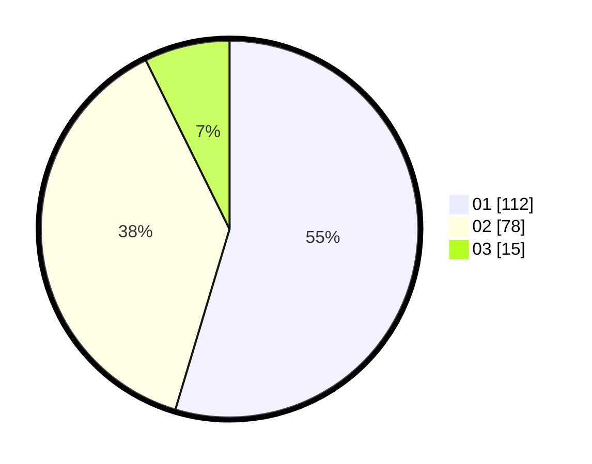

# Hasil

Hasil perolehan suara paslon dapat dilihat pada file paslon-01.txt, paslon-02.txt, dan paslon-03.txt.

Jika tidak ada, artinya data tersebut belum ada pada SIREKAP.

## Perolehan Suara

 * Paslon 01: **112**.
 * Paslon 02: **78**.
 * Paslon 03: **15**.

## Foto C Plano

https://sirekap-obj-formc.kpu.go.id/a382/pemilu/ppwp/31/73/06/10/02/3173061002126-20240214-235902--15c1c649-a401-4300-9692-f391922b77e8.jpg

https://sirekap-obj-formc.kpu.go.id/a382/pemilu/ppwp/31/73/06/10/02/3173061002126-20240214-235958--ff1ce0e5-e238-4f08-bd06-a39bf2dad8b6.jpg

https://sirekap-obj-formc.kpu.go.id/a382/pemilu/ppwp/31/73/06/10/02/3173061002126-20240215-000102--d8d11885-e57c-4b22-a109-3b49611befbd.jpg
