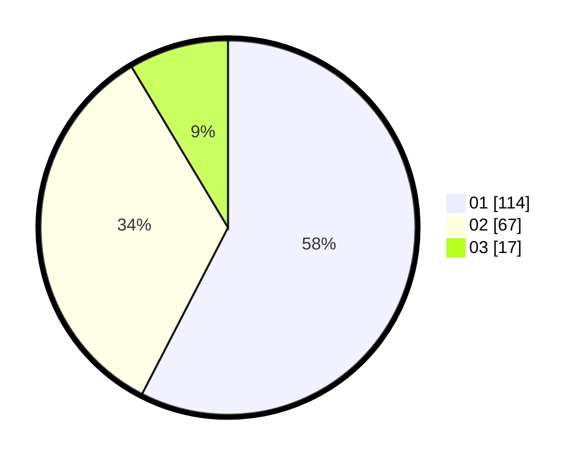

# Hasil

Hasil perolehan suara paslon dapat dilihat pada file paslon-01.txt, paslon-02.txt, dan paslon-03.txt.

Jika tidak ada, artinya data tersebut belum ada pada SIREKAP.

## Perolehan Suara

 * Paslon 01: **114**.
 * Paslon 02: **67**.
 * Paslon 03: **17**.

## Foto C Plano

https://sirekap-obj-formc.kpu.go.id/ddb1/pemilu/ppwp/31/73/06/10/02/3173061002127-20240214-155030--62837ca2-257a-4c0b-a4bc-86ea8b833923.jpg

https://sirekap-obj-formc.kpu.go.id/ddb1/pemilu/ppwp/31/73/06/10/02/3173061002127-20240214-191756--673427d2-a299-47ea-8c55-297a4b2a461e.jpg

https://sirekap-obj-formc.kpu.go.id/ddb1/pemilu/ppwp/31/73/06/10/02/3173061002127-20240214-155905--afe84ef9-9b38-415c-b1c9-27d85a9dff52.jpg

## DATA PEMILIH TETAP

Jumlah pemilih dalam DPT: **264**.
 * L: **137**.
 * P: **127**.

## DATA PENGGUNA HAK PILIH

Jumlah pengguna hak pilih dalam DPT: **195**.
 * L: **95**.
 * P: **100**.

Jumlah pengguna hak pilih dalam DPTb: **0**.
 * L: **0**.
 * P: **0**.

Jumlah pengguna hak pilih dalam DPK: **4**.
 * L: **1**.
 * P: **3**.

Jumlah pengguna hak pilih: **199**.
 * L: **96**.
 * P: **103**.

## JUMLAH SUARA SAH DAN TIDAK SAH

JUMLAH SELURUH SUARA SAH: **198**.

JUMLAH SUARA TIDAK SAH: **1**.

JUMLAH SELURUH SUARA SAH DAN SUARA TIDAK SAH: **199**.
