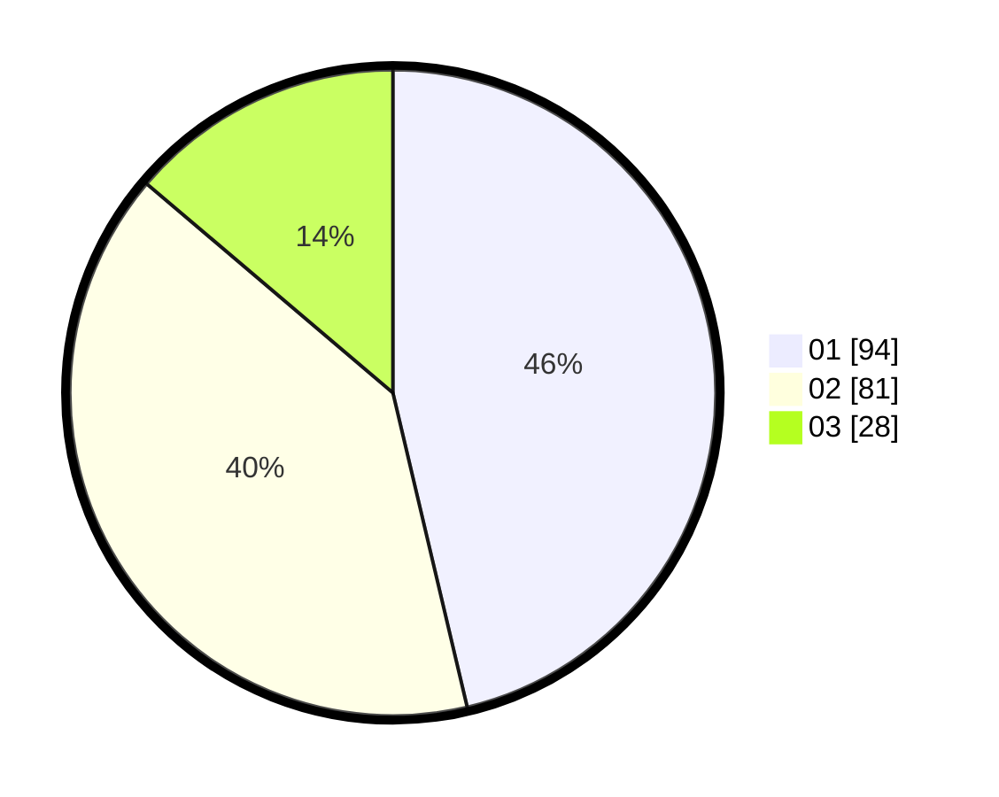

# Hasil

Hasil perolehan suara paslon dapat dilihat pada file paslon-01.txt, paslon-02.txt, dan paslon-03.txt.

Jika tidak ada, artinya data tersebut belum ada pada SIREKAP.

## Perolehan Suara

 * Paslon 01: **94**.
 * Paslon 02: **81**.
 * Paslon 03: **28**.

## Foto C Plano

https://sirekap-obj-formc.kpu.go.id/0edc/pemilu/ppwp/31/73/06/10/02/3173061002128-20240214-211627--f808dbc7-b04d-4e83-aa09-13abd59e7bbd.jpg

https://sirekap-obj-formc.kpu.go.id/0edc/pemilu/ppwp/31/73/06/10/02/3173061002128-20240214-211747--6f912426-dec6-4933-a07f-897e10bdc225.jpg

https://sirekap-obj-formc.kpu.go.id/0edc/pemilu/ppwp/31/73/06/10/02/3173061002128-20240214-211846--7bcf0618-9f07-4ea3-9a2e-91265e4c1847.jpg
