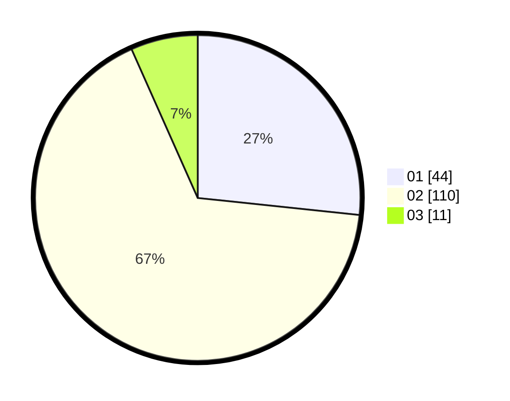

# Hasil

Hasil perolehan suara paslon dapat dilihat pada file paslon-01.txt, paslon-02.txt, dan paslon-03.txt.

Jika tidak ada, artinya data tersebut belum ada pada SIREKAP.

## Perolehan Suara

 * Paslon 01: **44**.
 * Paslon 02: **110**.
 * Paslon 03: **11**.

## Foto C Plano

https://sirekap-obj-formc.kpu.go.id/e1a5/pemilu/ppwp/31/73/06/10/02/3173061002129-20240214-211526--13552f79-19a8-4106-84a1-3996a0aaf66e.jpg

https://sirekap-obj-formc.kpu.go.id/e1a5/pemilu/ppwp/31/73/06/10/02/3173061002129-20240214-211645--d503ec0c-2fc4-4066-b1ec-2d1d1b270ae6.jpg

https://sirekap-obj-formc.kpu.go.id/e1a5/pemilu/ppwp/31/73/06/10/02/3173061002129-20240214-211804--c615df26-63db-4990-ac70-b7207a11167f.jpg

## DATA PEMILIH TETAP

Jumlah pemilih dalam DPT: **251**.
 * L: **125**.
 * P: **126**.

## DATA PENGGUNA HAK PILIH

Jumlah pengguna hak pilih dalam DPT: **167**.
 * L: **80**.
 * P: **87**.

Jumlah pengguna hak pilih dalam DPTb: **0**.
 * L: **0**.
 * P: **0**.

Jumlah pengguna hak pilih dalam DPK: **0**.
 * L: **0**.
 * P: **0**.

Jumlah pengguna hak pilih: **167**.
 * L: **80**.
 * P: **87**.

## JUMLAH SUARA SAH DAN TIDAK SAH

JUMLAH SELURUH SUARA SAH: **165**.

JUMLAH SUARA TIDAK SAH: **2**.

JUMLAH SELURUH SUARA SAH DAN SUARA TIDAK SAH: **167**.
