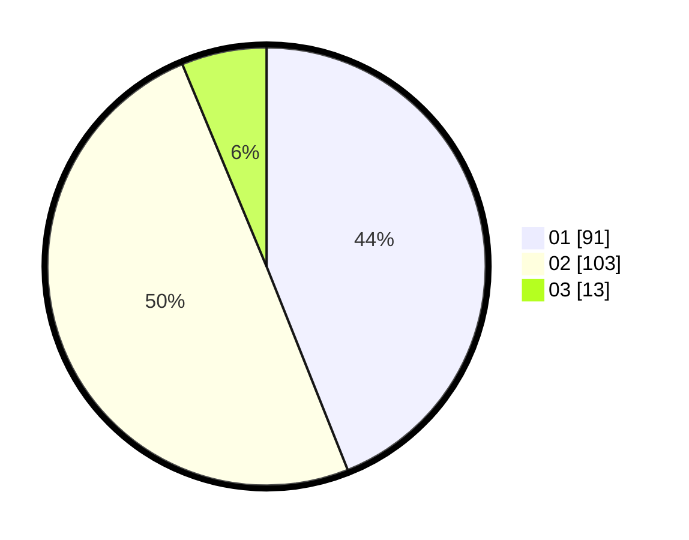

# Hasil

Hasil perolehan suara paslon dapat dilihat pada file paslon-01.txt, paslon-02.txt, dan paslon-03.txt.

Jika tidak ada, artinya data tersebut belum ada pada SIREKAP.

## Perolehan Suara

 * Paslon 01: **91**.
 * Paslon 02: **103**.
 * Paslon 03: **13**.

## Foto C Plano

https://sirekap-obj-formc.kpu.go.id/b3f8/pemilu/ppwp/31/73/06/10/02/3173061002130-20240214-214615--4db59f76-8f6e-4bfd-b9b1-8b59414d0c04.jpg

https://sirekap-obj-formc.kpu.go.id/b3f8/pemilu/ppwp/31/73/06/10/02/3173061002130-20240214-214746--9cee95a5-52d4-4544-ae9b-c41dd95397a5.jpg

https://sirekap-obj-formc.kpu.go.id/b3f8/pemilu/ppwp/31/73/06/10/02/3173061002130-20240214-204303--2a776876-8af4-48ff-ba63-fb2b36d4a74c.jpg
