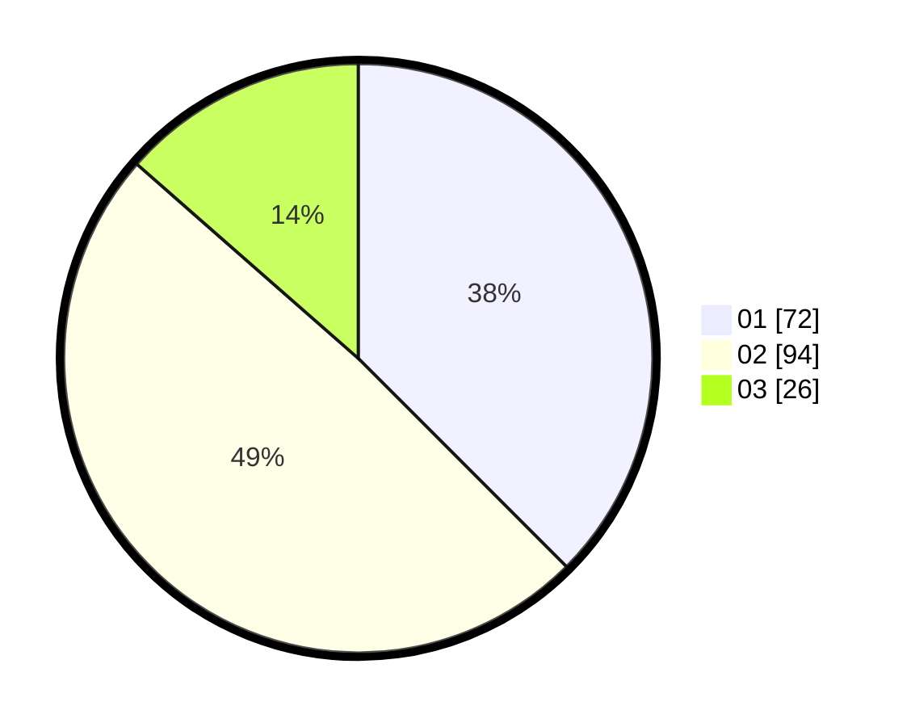

# Hasil

Hasil perolehan suara paslon dapat dilihat pada file paslon-01.txt, paslon-02.txt, dan paslon-03.txt.

Jika tidak ada, artinya data tersebut belum ada pada SIREKAP.

## Perolehan Suara

 * Paslon 01: **72**.
 * Paslon 02: **94**.
 * Paslon 03: **26**.

## Foto C Plano

https://sirekap-obj-formc.kpu.go.id/541b/pemilu/ppwp/31/73/06/10/02/3173061002133-20240216-134412--bde981d3-dd95-443f-9f21-0e8f0d63365b.jpg

https://sirekap-obj-formc.kpu.go.id/541b/pemilu/ppwp/31/73/06/10/02/3173061002133-20240216-134414--8e4b3509-4949-4530-8af7-356e747e596f.jpg

https://sirekap-obj-formc.kpu.go.id/541b/pemilu/ppwp/31/73/06/10/02/3173061002133-20240216-134413--b8ef11d0-ee49-49f3-8cf6-0316e13727b7.jpg

## DATA PEMILIH TETAP

Jumlah pemilih dalam DPT: **259**.
 * L: **126**.
 * P: **133**.

## DATA PENGGUNA HAK PILIH

Jumlah pengguna hak pilih dalam DPT: **191**.
 * L: **83**.
 * P: **108**.

Jumlah pengguna hak pilih dalam DPTb: **3**.
 * L: **1**.
 * P: **2**.

Jumlah pengguna hak pilih dalam DPK: **0**.
 * L: **0**.
 * P: **0**.

Jumlah pengguna hak pilih: **194**.
 * L: **84**.
 * P: **110**.

## JUMLAH SUARA SAH DAN TIDAK SAH

JUMLAH SELURUH SUARA SAH: **192**.

JUMLAH SUARA TIDAK SAH: **2**.

JUMLAH SELURUH SUARA SAH DAN SUARA TIDAK SAH: **194**.
