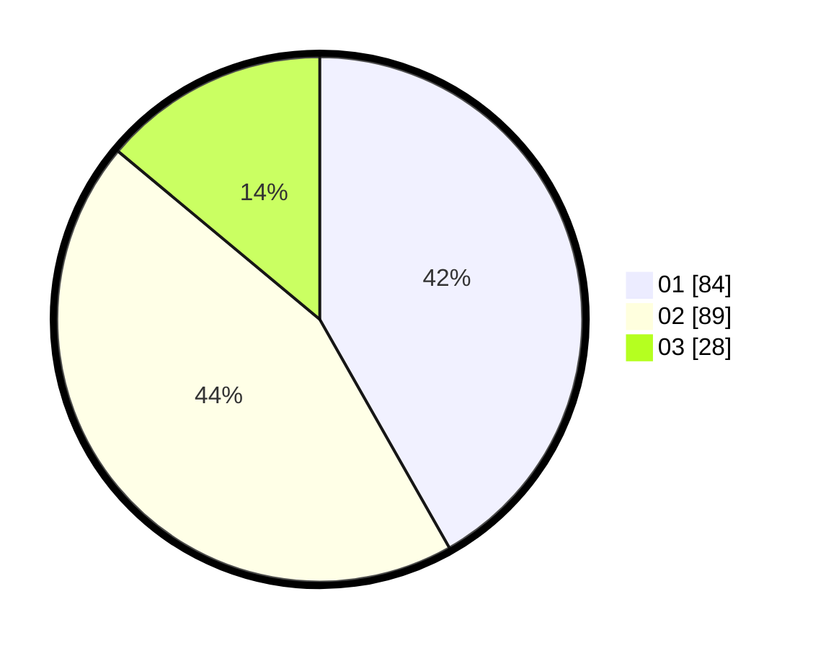

# Hasil

Hasil perolehan suara paslon dapat dilihat pada file paslon-01.txt, paslon-02.txt, dan paslon-03.txt.

Jika tidak ada, artinya data tersebut belum ada pada SIREKAP.

## Perolehan Suara

 * Paslon 01: **84**.
 * Paslon 02: **89**.
 * Paslon 03: **28**.

## Foto C Plano

https://sirekap-obj-formc.kpu.go.id/5ff5/pemilu/ppwp/31/73/06/10/02/3173061002137-20240214-222312--577bb17d-825c-40f2-85b5-3023411cc192.jpg

https://sirekap-obj-formc.kpu.go.id/5ff5/pemilu/ppwp/31/73/06/10/02/3173061002137-20240214-222507--8e391fa5-8d7e-4862-94d7-752926d627dd.jpg

https://sirekap-obj-formc.kpu.go.id/5ff5/pemilu/ppwp/31/73/06/10/02/3173061002137-20240214-223554--13026787-bd7c-4857-a5a0-a92b8a7df1f4.jpg
