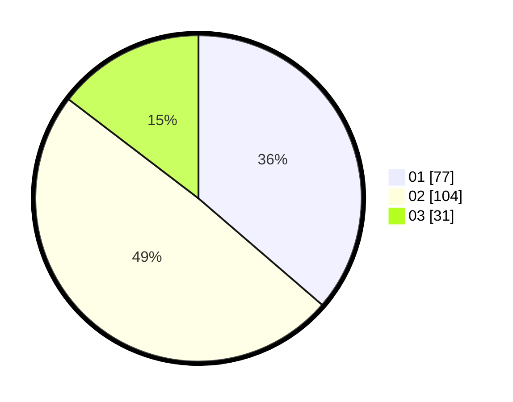

# Hasil

Hasil perolehan suara paslon dapat dilihat pada file paslon-01.txt, paslon-02.txt, dan paslon-03.txt.

Jika tidak ada, artinya data tersebut belum ada pada SIREKAP.

## Perolehan Suara

 * Paslon 01: **77**.
 * Paslon 02: **104**.
 * Paslon 03: **31**.

## Foto C Plano

https://sirekap-obj-formc.kpu.go.id/23df/pemilu/ppwp/31/73/06/10/02/3173061002138-20240215-004354--ce57fd48-f162-4845-a553-5c7ea566263c.jpg

https://sirekap-obj-formc.kpu.go.id/23df/pemilu/ppwp/31/73/06/10/02/3173061002138-20240215-004528--c022cfb0-279c-457c-a8cd-8d1e3267e189.jpg

https://sirekap-obj-formc.kpu.go.id/23df/pemilu/ppwp/31/73/06/10/02/3173061002138-20240215-004629--6f0d2e7a-1a28-44ca-8977-2d14bcb43e3f.jpg
