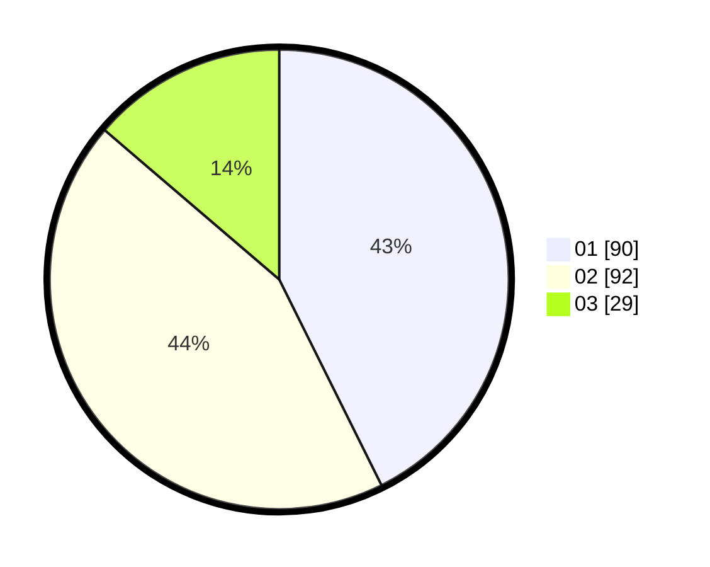

# Hasil

Hasil perolehan suara paslon dapat dilihat pada file paslon-01.txt, paslon-02.txt, dan paslon-03.txt.

Jika tidak ada, artinya data tersebut belum ada pada SIREKAP.

## Perolehan Suara

 * Paslon 01: **90**.
 * Paslon 02: **92**.
 * Paslon 03: **29**.

## Foto C Plano

https://sirekap-obj-formc.kpu.go.id/fc4a/pemilu/ppwp/31/73/06/10/02/3173061002139-20240214-225102--88872145-9b7b-4a6e-88d0-b387548476c7.jpg

https://sirekap-obj-formc.kpu.go.id/fc4a/pemilu/ppwp/31/73/06/10/02/3173061002139-20240214-230247--aaf44707-b190-4dcb-98b6-794b714a1d09.jpg

https://sirekap-obj-formc.kpu.go.id/fc4a/pemilu/ppwp/31/73/06/10/02/3173061002139-20240214-230422--52d28630-2621-4774-bdb7-fb9a5d037676.jpg
