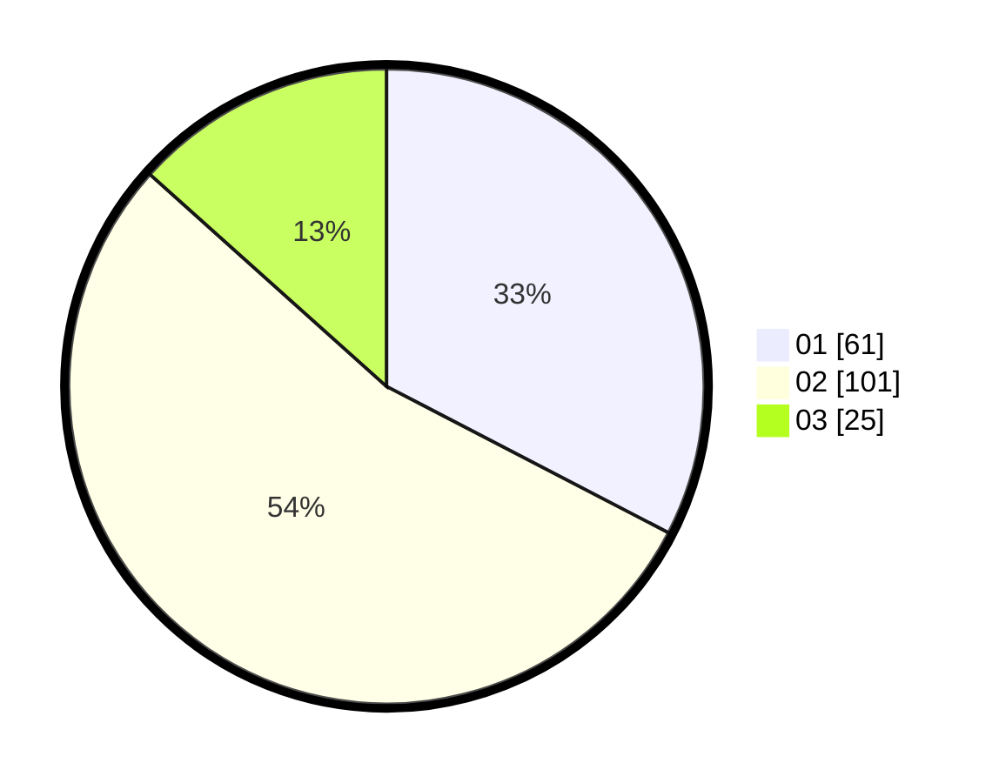

# Hasil

Hasil perolehan suara paslon dapat dilihat pada file paslon-01.txt, paslon-02.txt, dan paslon-03.txt.

Jika tidak ada, artinya data tersebut belum ada pada SIREKAP.

## Perolehan Suara

 * Paslon 01: **61**.
 * Paslon 02: **101**.
 * Paslon 03: **25**.

## Foto C Plano

https://sirekap-obj-formc.kpu.go.id/ca1e/pemilu/ppwp/31/73/06/10/02/3173061002141-20240214-225927--4b110586-afc2-4044-93dc-f2d0463ee31e.jpg

https://sirekap-obj-formc.kpu.go.id/ca1e/pemilu/ppwp/31/73/06/10/02/3173061002141-20240214-225428--b9710ddf-7f4d-4c5a-85e3-f12e30c40398.jpg

https://sirekap-obj-formc.kpu.go.id/ca1e/pemilu/ppwp/31/73/06/10/02/3173061002141-20240214-225552--b13a76c9-c639-4863-8b66-4564eac437b7.jpg
